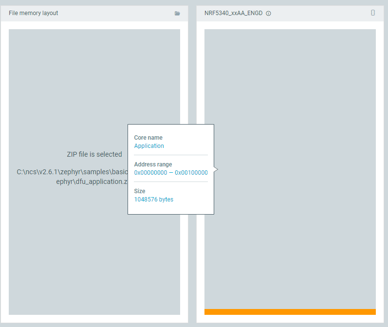
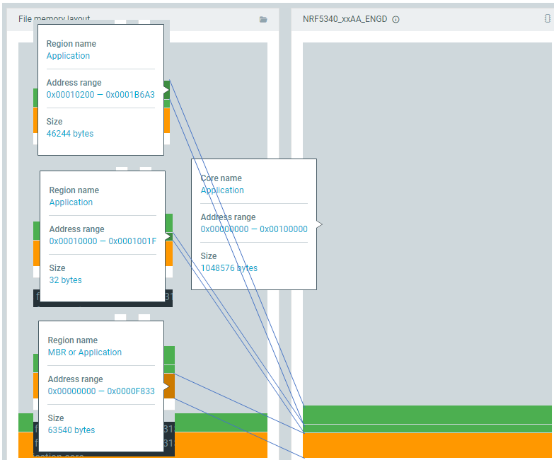
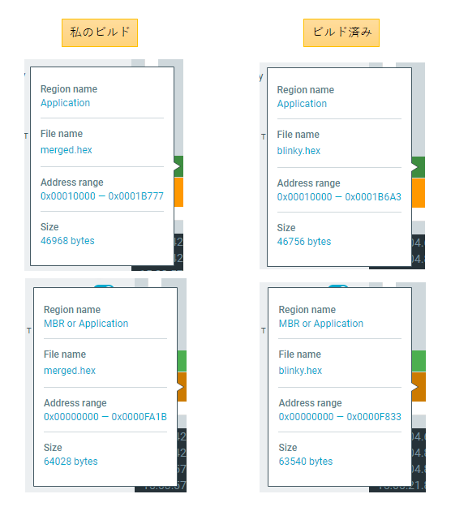
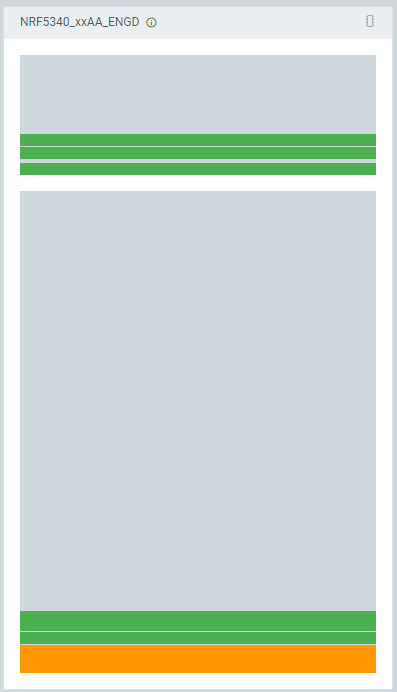
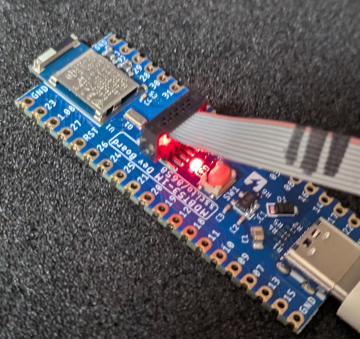

# 2024/07/04

## nRF5340 MDBT53-1M用のビルドがうまくいかない

[nRF5340](https://docs.nordicsemi.com/category/nrf5340-category)の評価ボード[nRF5340 MDBT53-1Mモジュールピッチ変換基板](https://www.switch-science.com/products/8658)をスイッチサイエンスさんから購入した。  

* nRF5340
  * Raytac nRF5340 MDBT53-1Mモジュール（チップアンテナ）搭載
* USB Type-Cコネクタ
  * 電源入力
  * ソフトウェアの書込みに使える
* 主な載っている部品
  * LED x1
  * SW x1
  * 1.27mm 10pin SWDコネクタ

親切なことに[使い方ガイド](https://144lab.kibe.la/shared/entries/467b2482-2346-4c3e-8e0f-28d7403de2b9)がある。
これを書いている時点では最終編集日は2023年9月1日。
手順通りにやって、プリコンパイル済みのzipファイルやhexファイルはUSBやJLinkを使って焼き、動くことが確認できた。  
しかし、自分でビルドしたファイルを焼いても期待通り動作しなかった。

----

ビルドしたのは手順通り blinky である。LEDが定期的に点滅するだけでBLE機能など使っていないと思う。

記事との違いは、NCS(Nordic Connect SDK)のバージョンくらいか。
私は今の最新である<u><b>v2.6.1</b></u>で記事は<u><b>v2.4.0</b></u>である。
NCSをインストールしているパスも違うが、そこは許容範囲内だろう(私はCドライブ直下にインストールしている)。

そしてこのバージョン違いが今回のうまくいかない原因であった。

## Memory Map

以前はnRFgo Studio(だっけ)を使ってHEXファイルのメモリ配置を見ることができたような気がする。もしかしたら直接メモリを見ていたのかもしれないが。  
今では、nRF Connect for Desktopから起動した「Programmer」を使って同じことができそうだ。

こちらが、私がビルドしたHEXファイルを焼いた後のメモリマップ。



こちらが、ビルド済みのHEXファイルを焼いた後のメモリマップ。



何もかもが違う・・・。  
ビルド済みHEXファイルと私のビルドしたHEXファイルのレイアウトを並べてみよう。



多少サイズは違うが、NCSのバージョン違いによるものか？
一応Programmerで私のHEXファイルを焼いてみたが、やはりLEDは点滅しない。
「HEXファイルをProgrammerで焼く」「メモリレイアウトはだいたい同じ」なので、あとはもうHEXファイルそのものを疑うことになるか。

vscodeから ACTIONS > Flash で焼いた後に Programmer で READ するとこうなっていた。
上と下に分かれているが、これがコアを表している。上側がNetworkで下側がApplicationである。
先ほど見たときはApplicationコアだけしかなかったのだが、mcubootで焼いたんだったか？



## Build Configuration

* ⚠マークが出ているが、これはセキュアにするなら`_ns`が付いたのを選びなさい、ということだろう。


* "Custom boards"などのラジオボタンはコンボボックスに出てくる項目をフィルタするだけのもの
* ファイル名のサフィックスが`_cpuapp`となっているが、これはnRF5340が2コア構成だからのようだ。
  * [Nordic nRF5340 と nRF Connect SDK にハマる • IoT ソフトウェア設計のファームロジックス \[相模原\]](https://flogics.com/wp/2020/07/nordic-nrf5340-and-nrf-connect-sdk/)
  * ネットワーク側は`_cpunet`なのだろう

## Build

ビルドすると、vscodeのTerminalにビルドのログが流れ始める。  
以前は"nRF Terminal"というタブを使っていたようだが、今はTerminalに出力するようになっているようだ。  
もちろんビルドは最後まで行われているのだが、WARNINGはいくつか出ている。  
Terminalのログはモノクロで出力されるので、ERRORやWARNINGを探すのが結構つらい。

* CONFIGの設定(`!CONFIG_TEST && CONFIG_ASSERT && !CONFIG_FORCE_NO_ASSERT`)で出しているだけ。

```log
CMake Warning at C:/ncs/v2.6.1/zephyr/CMakeLists.txt:1957 (message):
  __ASSERT() statements are globally ENABLED
```

* デフォルトの鍵ペアを使っているから自分で作った方がよいよ、という警告か
  * NSIBはたぶん["nRF Secure Immutable Bootloader"](https://docs.nordicsemi.com/bundle/ncs-latest/page/nrf/samples/bootloader/README.html)の略
  * USBで使える"MCUboot"がこれ？
  * 商品ページに「出荷時に書き込まれているブートローダーはデフォルトの秘密鍵を使用しているので、本番環境では利用しないでください」と書いてあるのがこの件だろう

```log
CMake Warning at C:/ncs/v2.6.1/nrf/subsys/bootloader/cmake/debug_keys.cmake:36 (message):
  

      --------------------------------------------------------------
      --- WARNING: Using generated NSIB public/private key-pair. ---
      --- It should not be used for production.                  ---
      --- See CONFIG_SB_SIGNING_KEY_FILE                         ---
      --------------------------------------------------------------
```

* CONFIGの設定(`!static_configuration && (CONFIG_BOOTLOADER_MCUBOOT || CONFIG_SECURE_BOOT)`)で出しているだけ。
  * `static_configuration`はよくわからん。`pm_static`関係の設定が見つからずに未設定になっているようだが`pm_static`もわからん。power managementか？
  * `CONFIG_BOOTLOADER_MCUBOOT`はyes、`CONFIG_SECURE_BOOT`はnoだった

```log
CMake Warning at C:/ncs/v2.6.1/nrf/cmake/partition_manager.cmake:79 (message):
  

          ---------------------------------------------------------------------
          --- WARNING: Using a bootloader without pm_static.yml.            ---
          --- There are cases where a deployed product can consist of       ---
          --- multiple images, and only a subset of these images can be     ---
          --- upgraded through a firmware update mechanism. In such cases,  ---
          --- the upgradable images must have partitions that are static    ---
          --- and are matching the partition map used by the bootloader     ---
          --- programmed onto the device.                                   ---
          ---------------------------------------------------------------------
```

* `LOG_DEFAULT_LEVEL`の設定が思ってたのと違う？

```log
warning: LOG_DEFAULT_LEVEL (defined at subsys/logging\Kconfig.filtering:13) was assigned the value
'0' but got the value ''. Check these unsatisfied dependencies: LOG (=n). See
http://docs.zephyrproject.org/latest/kconfig.html#CONFIG_LOG_DEFAULT_LEVEL and/or look up
LOG_DEFAULT_LEVEL in the menuconfig/guiconfig interface. The Application Development Primer, Setting
Configuration Values, and Kconfig - Tips and Best Practices sections of the manual might be helpful
too.
```

* `MCUBOOT_LOG_LEVEL_INF`がyesになっているが、最終的にシンボルが選択されなかった？

```log
warning: The choice symbol MCUBOOT_LOG_LEVEL_INF (defined at
subsys/logging/Kconfig.template.log_config:17) was selected (set =y), but no symbol ended up as the
choice selection. See http://docs.zephyrproject.org/latest/kconfig.html#CONFIG_MCUBOOT_LOG_LEVEL_INF
and/or look up MCUBOOT_LOG_LEVEL_INF in the menuconfig/guiconfig interface. The Application
Development Primer, Setting Configuration Values, and Kconfig - Tips and Best Practices sections of
the manual might be helpful too.
```

* これも同じようなやつか。

```log
warning: The choice symbol LOG_MODE_MINIMAL (defined at subsys/logging\Kconfig.mode:28) was selected
(set =y), but no symbol ended up as the choice selection. See
http://docs.zephyrproject.org/latest/kconfig.html#CONFIG_LOG_MODE_MINIMAL and/or look up
LOG_MODE_MINIMAL in the menuconfig/guiconfig interface. The Application Development Primer, Setting
Configuration Values, and Kconfig - Tips and Best Practices sections of the manual might be helpful
too.
```

* デフォルトの鍵ペアを使っている件だろう

```log
CMake Warning at C:/ncs/v2.6.1/nrf/modules/mcuboot/CMakeLists.txt:382 (message):
  

          ---------------------------------------------------------
          --- WARNING: Using default MCUBoot key, it should not ---
          --- be used for production.                           ---
          ---------------------------------------------------------
```

ビルドログだけであれば特にダメそうなところはないような気がする。

## ACTIONS > Debug

困ったらデバッグだ。  
vscodeからはblinkyの`main.c`しか見えないので、最初の方にブレークポイントを設定して ACTIONS > Debug を実行した。
これができなかったらどうしようもなかったのだが、幸い作動してくれた。

`BOOT_LOG_ERR()`の変数のうちデバッガで確認できた値は`rc=-19`と`image_index=0`。
あとは最適化されていた。


メッセージで検索すると、こういうのが出てきた。`-19`なのは同じで ncs v2.6.1 なのも同じなので参考にできるかも。
ただ、これを書いている時点では解決していない。

[Failed to open flash area ID 2 (image 0 slot 1): -19, cannot continue - Nordic Q&A - Nordic DevZone - Nordic DevZone](https://devzone.nordicsemi.com/f/nordic-q-a/112192/failed-to-open-flash-area-id-2-image-0-slot-1--19-cannot-continue)

## ncs v2.4.0 に戻す

使い方ガイドでは ncs v2.4.0 を使っている。ブートローダの仕様が変わったということがあってもおかしくない・・・のか？  
ともかく、ToolchainとSDKにv2.4.0をインストールしてアクティブにする。

結果は・・・動いた！



うーん、まだまだ分からんことが多いのぅ。。。
