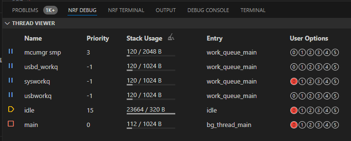
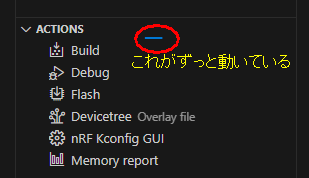
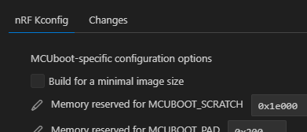

# MCUboot (5)

<i>2024/07/15</i>

評価ボード[nRF5340 MDBT53-1Mモジュールピッチ変換基板](https://www.switch-science.com/products/8658)が自分でビルドしたアプリを焼くと動かない件の調査である。

* [MCUboot (1)](20240708-boot.md)
* [MCUboot (2)](20240711-boot.md)
* [MCUboot (3)](20240713-boot.md)
* [MCUboot (4)](20240714-boot.md)

## DevAcademyの続き

引き続き[inter_less8_exer2_solution](https://github.com/NordicDeveloperAcademy/ncs-inter/tree/main/lesson8/inter_less8_exer2_solution)を見ていく。

前回はオリジナルで動かなかったというところまでで終わった。

* `boards/nrf5340dk_nrf5340_cpuapp_ns.conf`を削除
  * ncsに付属している`nrf5340dk_nrf5340_cpuapp_ns`を使った
  * リポジトリに入っていた方は`CONFIG_MCUBOOT_USE_ALL_AVAILABLE_RAM=y`だけがある。netの方のアップデートをするにはRAMが大量にいるから制限を外す、みたいなコメントがあった。
  * ビルドしたファイルには`CONFIG_MCUBOOT_USE_ALL_AVAILABLE_RAM`がセットされていなかったから影響はあるかもしれんが今回は無視。
  * `_ns`は[Board Names](https://docs.nordicsemi.com/bundle/ncs-latest/page/nrf/config_and_build/board_support/board_names.html)からするとCMSE(Cortex-M Security Extensions)を使っている場合なのか。
    * アプリをNSPE(Non-Secure Processing Environment)に配置するから`_ns`(non-secure)なのだろうか？ 確かに`cpapp`との組み合わせしかないな。
* `child_image/`を削除
* `app.overlay`の編集
  * `chosen`があるブロックをコメントアウト
  * `zephyr_udc0`もコメントアウトして良いが、残しておくとUSBシリアルとして認識してくれるようになる。
  * MDBT53にあわせてLEDとボタンのGPIOを変更

overlayファイルを変更した後はPristine Build(初期のビルド)がいる。Kconfigなどからやり直すのでRebuildだと思っている。

USBシリアルとして認識はするがボタンを押したまま起動してもLEDが点滅するので`main()`まで到達しているのだろう。
`prj.conf`に書くだけではダメなのか、ボタンを認識していないのか。

少しアプリを書き換え、ボタンを押したらLEDが点灯するように変更。

```c
...
#define BUTTON0_NODE DT_ALIAS(sw0)
static const struct gpio_dt_spec button = GPIO_DT_SPEC_GET(BUTTON0_NODE, gpios);

int main(void)
{
  ...
  if (!device_is_ready(button.port)) {
    return 0;
  }
  ret = gpio_pin_configure_dt(&button, GPIO_INPUT);
  if (ret < 0) {
    return 0;
  }

  while (1) {
    if (gpio_pin_get_dt(&button)) {
      gpio_pin_set_dt(&led, 1);
    } else {
      gpio_pin_set_dt(&led, 0);
    }
    k_msleep(100);
  }
  ...
```

これは動作した。
Devicetree EditorでGPIOに`ACTIVE_LOW`などを設定したが、`gpio_pin_get_dt()`や`gpio_pin_set_dt()`を使うと設定を参照して引数で "1=HIGH", "0=LOW" ということにしておけばうまいことやってくれるのだろう。
便利ではあるが、GPIOに設定するだけなのにいろいろ設定を確認したり条件を見たりと処理が重たい。
まあ、nRF5340ともなると動作クロックが64MHz/128MHzもあるので誤差の範囲なのか。

関数名のサフィックス`_dt`はDeviceTreeのことらしい。
`gpio_pin_set_dt(1)` → `gpio_pin_set` → `gpio_pin_set_raw` → `gpio_port_set_bits_raw` → `z_impl_gpio_port_set_bits_raw` → `api->port_set_bits_raw` となかなかに深い。

----

話が脱線した。  
少なくとも`main()`レベルではボタンを認識できていることは分かった。
ブートローダでボタンを読むところを通っていないのか、そもそもビルドされていないのか。
デバッグできれば分かるのだが。。。

と`bootloader/mcuboot/boot/zephyr/main.c`の`main()`にブレークポイントを置いて ACTIONS > Debug したら止まって、ステップ実行できた！  
NRF DEBUG にもなにやら表示がある。



チュートリアルに書いてある「APPLICATIONS で "mcuboot" にフォーカスを当てる」をすると、ACTIONS が処理中？のような状態になってしまい、以降の操作がうまくいかなくなってしまう。
30分ほど放置しても終わらないので、ダメなのだろう。
このまま ACTIONS のコマンドをクリックすると「Actual command not found, wanted to execute nrf-connect.kconfig」のようなエラーメッセージが出る。



`lesson8/inter_less8_exer2_solution`の中に`build/`のようなディレクトリは無いので、設定はそれ以外のファイルにあると考えるのが妥当だろう。
"APPLICATIONS" には複数の Build Configuration が存在できるので "ACTIONS" の操作をするのにどの Configuration を使うのか選択するというのは意味があるが、その中のディレクトリは気にしなくてもよいのでは？

が、処理中になったままになるのはおかしいし、自作のblinkyプロジェクトでは問題ないのだ。
"mcuboot"を選択して"ACTIONS > nRF Kconfig GUI"を開くと一番上に "MCUboot-specific configuration options" などと意味ありげなことが表示されているので非常に気になる。



ncs を v2.7.0 から v2.6.1 に変更して Build Configuration を作り直すと、"APPLICATIONS"で"mcuboot"をクリックしても問題なくなった。
そういう話なの？？
blinkyプロジェクトは v2.7.0 で問題ないので、設定のどれかが v2.7.0 から変わったとかかもしれない。

----

では、次は`child_image/`を元に戻して Pristine Build。
`app.overlay`の`chosen`コメントアウトはそのままにしている。

これはビルドエラーになった。
出力がいろいろあるが「zephyr\zephyr_pre0.elf section `noinit' will not fit in region `RAM'」と「region `RAM' overflowed by 7960 bytes」だろう。
サイズどうのこうのいっているのは`CONFIG_MCUBOOT_USE_ALL_AVAILABLE_RAM=y`を指定していないからか？

`prj.conf`に`CONFIG_MCUBOOT_USE_ALL_AVAILABLE_RAM=y`を追加して Prestine Build。
これはビルドできた。  
ACTIONS > Flash も成功。`main()`も起動してボタンを押すとLEDが点く。
ただ、ボタンを押し球M起動しても`main()`まで到達しているようなので、DFU over USB はできていないだろう。

----

ではでは、`app.overlay`の`chosen`コメントアウトも元に戻して、ほとんどオリジナルと同じくらいに戻す。

Pristine Buildは成功。  
Flashも成功。  
しかし`main()`まで到達しない。
ボタンを押しながら起動しても特に変わらず。USBはデバイスとして認識されていない。

ようやくここまで絞り込めた。

```
/* Step 4.2 - choose CDC ACM for mcumgr */
/* Step 8.1 - Add external flash */
/ {
	chosen {
		zephyr,uart-mcumgr = &cdc_acm_uart0;
		nordic,pm-ext-flash = &mx25r64;
	};
};
```

2行あるが、1行目は CDC ACM、2行目は[https://docs.nordicsemi.com/bundle/ncs-latest/page/nrf/scripts/partition_manager/partition_manager.html#external-flash-memory-partitions](https://docs.nordicsemi.com/bundle/ncs-latest/page/nrf/scripts/partition_manager/partition_manager.html#external-flash-memory-partitions)関係。
External FlashといってもMDBT53にそんなのは無いが？  
[nRF5340DK](https://www.nordicsemi.com/Products/Development-hardware/nRF5340-DK)だってそんなものは...

> An on-board external memory is connected to the 96 MHz QSPI peripheral in the nRF5340 SoC.

あるのか！ そりゃ動かんわ。

2行目だけ削除したら動くようになりました。

Devicetree Visual Editorに表示されているFLASHのマップはこんな感じ。
"non-secure"になっているエリアが NSPE というやつかな。


さて、ここまで進んでも「ボタンを押してDFUモードになる」が実現できていない。
