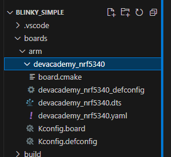

# DevAcademy "Adding custom board support" (2)

<i>2024/07/23</i>

引き続き DevAcademy Intermediateの[Adding custom board support](https://academy.nordicsemi.com/courses/nrf-connect-sdk-intermediate/lessons/lesson-3-adding-custom-board-support/)を見ていく。

の前に、今さらだが SoC とか SiP とかが何かを確認しよう。

* [SiP - Wikipedia](https://ja.wikipedia.org/wiki/SiP)
* [《半導体の後工程を学ぶ②》SoCとSiPを比較して解説｜SiPのメリット・課題は？ - アイアール技術者教育研究所](https://engineer-education.com/semiconductor_back-end-process02_soc-sip/)

どちらも外見としては1つなのか。
大ざっぱにいうと、シリコンレベルでの作り方の違いってことでよいのかな。
SoC/SiPと列挙しておけば間違いなさそうだが、ここでは SoC と書くことにしよう。

----

## [Board definition](https://academy.nordicsemi.com/courses/nrf-connect-sdk-intermediate/lessons/lesson-3-adding-custom-board-support/topic/board-definition/)の続き

* ncsではハードウェアの記述をコードではなく Devicetree/Kconfig に記述する。
  * Devicetreeファイルはハードウェアについて(SoCの指定、ペリフェラルの設定など)
  * Kconfigファイルはハードウェアに必要なRTOSやソフトウェアについて
  * オプショナルで、特定のハードウェアについての初期化をCファイルに書くことができるし、ドキュメントも書くことができる
* board definitionの内容
  * SiP/Soc configuration
    * これは使用するSoCのDTSIファイルをincludeすればよい
      * 例えばnRF5340DKのcpuappだと[nrf5340_cpuapp_qkaa.dtsi](https://github.com/nrfconnect/sdk-zephyr/blob/v3.5.99-ncs1-1/boards/arm/nrf5340dk_nrf5340/nrf5340dk_nrf5340_cpuapp.dts#L8)など
      * cpuapp_nsだと`nrf5340_cpuappns_qkaa.dtsi`
  * Peripheral configuration
    * board definitionはnon-secureかそうでないかで設定は別になるが、ペリフェラルの設定は同じになるからDTSIファイルにしているようだ
      * [nrf5340_cpuapp_common.dtsi](https://github.com/nrfconnect/sdk-zephyr/blob/v3.5.99-ncs1-1/boards/arm/nrf5340dk_nrf5340/nrf5340_cpuapp_common.dtsi)
  * Memory configuration
    * partition confか？
      * [nrf5340_cpuapp_partition_conf.dtsi](https://github.com/nrfconnect/sdk-zephyr/blob/v3.5.99-ncs1-1/boards/arm/nrf5340dk_nrf5340/nrf5340_cpuapp_partition_conf.dtsi)か？
      * nrf5340_cpuapp_common.dtsiにも[Flash情報](https://github.com/nrfconnect/sdk-zephyr/blob/v3.5.99-ncs1-1/boards/arm/nrf5340dk_nrf5340/nrf5340_cpuapp_common.dtsi#L225-L254)や[SRAM情報](https://github.com/nrfconnect/sdk-zephyr/blob/v3.5.99-ncs1-1/boards/arm/nrf5340dk_nrf5340/nrf5340_cpuapp_common.dtsi#L265-L284)らしきものがある
  * Pin mapping
    * これもペリフェラルと同じでDTSIファイルにするのがよさそう
    * [nrf5340_cpuapp_common-pinctrl.dtsi](https://github.com/nrfconnect/sdk-zephyr/blob/v3.5.99-ncs1-1/boards/arm/nrf5340dk_nrf5340/nrf5340_cpuapp_common-pinctrl.dtsi)
  * Clock configuration
  * Interrupt configuration
  * Driver configuration
  * Special Initialization Routines

後半の項目は設定がどこにあるか分からなかったが、たぶん cpuapp_common DTSファイルにあるんじゃなかろうか。
MDBT53の定義ファイルには`board.c`があったので、それが"Special Initialization Routines"だろう。

nRF5340DKを参考にDTSファイルのinclude関係を図にするとこうだった。

### Hardware support hierarchy

これは[前回](./20240722-da.md)書いたので省略。
[ウェビナー](https://view-su3.highspot.com/viewer/653a5c88991f1996435e1672)で最初の方に出てきたので、その流れで前回書いたのだった。

### Drivers

いわゆるドライバの部分だが、SoCが内蔵しているペリフェラルについては ncs や zephyr に同梱されていて、そこから先につないだセンサーなどのデバイスについては自分でドライバを作らないといけないか、あるいは類似のドライバ(部品は違うけどプロトコルは同じということはしばしばある)は`compatible`キーワードを使ってうまいことできるらしい。
サンプルがあるようだが、まだ私には早かろう。

## [Creating board files](https://academy.nordicsemi.com/courses/nrf-connect-sdk-intermediate/lessons/lesson-3-adding-custom-board-support/topic/creating-board-files/)

### Naming your custom board

新しいboard definitionはコマンドラインから`west board`で作ることもできそうだが、vscodeを使っているなら"Create a new board"からGUIで作ることができる。
GUIといっても文字を入力するだけだが、SoCはリストから選択できるので楽かもしれない。

DevAcademyではnRF52833になっているが、手持ちがnRF5340なのでそちらにしておく。

* human-readable name: `DevAcademy nRF5340`
* board ID: `devacademy_nrf5340` (自動)
* SoC: nRF5340_cpuapp(Secure)
* board root directory: 開いていた`blinky`サンプルそのまま
* company name: hirokuma

とすると、今開いていたプロジェクトの中にディレクトリが作られ、ファイルも置かれた。
`common`や`pinctrl`はもちろんないし、`partition_conf`もない。そういうのは自分でやるしかあるまい。

何も考えずにこの設定でビルドしたらエラーになった。
これは`main.c`にあるLEDの定義がないからだろう。

### Where to define your custom board

今回は custom board をデフォルトに任せて作成したのでカレントのプロジェクトにディレクトリが追加されたが、置き場所は以下のどれかにすることができる。

* Upstream in Zephyr、つまり Zephyr 標準のような扱いにしたい場合はこれになる。[sdk-zephyr/boards/arm/](https://github.com/nrfconnect/sdk-zephyr/tree/v3.5.99-ncs1-1/boards/arm)の中に置いてあるのがそれだろう。
* In a dedicated directory、つまり専用ディレクトリを作ってそこに置く。[MDBT53の設定](https://144lab.kibe.la/shared/entries/467b2482-2346-4c3e-8e0f-28d7403de2b9#sdk%E3%81%AE%E3%82%A4%E3%83%B3%E3%82%B9%E3%83%88%E3%83%BC%E3%83%AB%E3%81%A8vscode%E3%81%AE%E8%A8%AD%E5%AE%9A)で説明しているのがこのやり方である。ncs 配下ではないので vscode にパスを追加することになる。
* In a `boards` folder in your application directory、つまり今回のようにアプリプロジェクトの直下に`board/`ディレクトリを作って置く。

### Board files

mandatory files がいろいろ出てくるが、さきほど作ったのには`pinctrl.dtsi`はなかった。
([CONFIG_PINCTRL](https://docs.nordicsemi.com/bundle/ncs-latest/page/nrf/config_and_build/configuring_app/hardware/pin_control.html#migration_of_the_devicetree_files)というものもあるが、この設定は`-pin`という古い書き方を有効にするためのようだ。)

うーん、mandatory といいながらテンプレートでは作ってくれない？
よくわからないが Exercise で実際に作るまでは放置だ。

* mandatory
  * `Kconfig.board`
  * `Kconfig.defconfig`
  * `<boardID>_defconfig`
  * `<boardID>.dts`
  * `<boardID>-pinctrl.dtsi`
* optional
  * `board.cmake`
  * `CMakeLists.txt`
  * `doc/index.rst`, `doc/<boardID>.png`
  * `Kconfig`
  * `<boardID>.yaml`

よくわからないのが`Kconfig.defconfig`と`<boardID>_defconfig`の違いだ。
こちらも Kconfig 関係で defconfig なのだが、前者はボード依存のKconfigデフォルト値、後者はKconfig fragmentだそうだ。

fragmentの方はアプリにマージされる＝ブートローダには反映されないという意味だろうか？
あるいは、必ずアプリにマージされるので`prj.conf`で変更できないということか？

考えても仕方ないので次に進もう。

## [Board files for multi-core hardware & TF-M](https://academy.nordicsemi.com/courses/nrf-connect-sdk-intermediate/lessons/lesson-3-adding-custom-board-support/topic/board-files-for-multi-core-hardware-tf-m/)

これはマルチコアのSoC向け。nRF53はそうなので読む。
nRF53はマルチコアかつTrustZoneあり、nRF91はシングルコアだがTrustZoneあり。
マルチコアについては cpuapp と cpunet と Flash が別領域になるのでなんとなくわかるのだが、TrustZone の non-secure などがよくわかっていないので役に立ちそうだ。

### Trusted Firmware-M (TF-M)

> Trusted Firmware-M(TF-M)はArm-M向けに調整されたSecure Processing Environment(SPE)を構築するための設計図である。TF-Mは機密事項とコードを保護するための分離によるセキュリティの原則に依存している。さらにTF-Mは Protected Storage、Cryptography、Attestation(証言証明、認証)を含むセキュリティサービスを提供することにより保護機能をアプリに拡張する。

とりあえず訳してみたが、わかるようなわからんような。。。
[Cortex-M用TrustZone](https://www.arm.com/ja/technologies/trustzone-for-cortex-m)はArmの機能である(nordicではなくという意味)。
Trusted Firmwareというのは一応オープンソースらしい。

[https://monoist.itmedia.co.jp/mn/articles/2002/04/news010_4.html](https://monoist.itmedia.co.jp/mn/articles/2002/04/news010_4.html)

NFCもそうだったが、Execution Environment(EE)とかTrusted EEとか呼ばれる外部から切り離された「安全な」環境で動かせるようになっていて、その環境内で何が動いているかは外部から分からないし、変更したりできないようなものがあったと思う。
TF-Mだとその環境を SPE と呼んでいて、そこで動くものは Secure、それ以外で動くものは Non-Secure ということだろう。
だからアプリは `cpuapp_ns` なのだ。`cpuapp` の場合は TF-M は使用できない。

じゃあ Secure なところでは何が動くのか、あるいはユーザのプログラムは Secure な環境で動くのかというと、図を見る限りは動かない。
ユーザのプログラムは濃い青なのだが、NSPE にしか割り当てられていない。
MCUboot が SPE にいるので、MCUboot から呼び出すコードも SPE になる。

章としては続けて nRF53 と nRF91 のことが書いてあったが、Exerciseをやった方がわかりやすい気がする。
