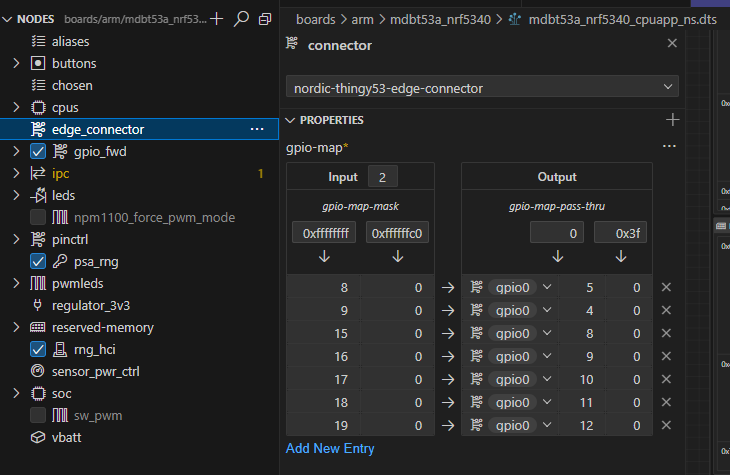

# Partition Manager (2)

<i>2024/07/30</i>

何をしたいのかぼやけてきたので整理しよう。
Partition Manager用のファイルを置いているのに自作のサンプルアプリのビルドでは読み込まれていないことを気にしている。

[Partition Manager](https://docs.nordicsemi.com/bundle/ncs-2.6.1/page/nrf/scripts/partition_manager/partition_manager.html#build_system)

最初の方に、

> The Partition Manager is a Python script that sets the start address and size of all the flash and RAM partitions in a multi-image build context.

multi-imageビルドで使われるようなことが書いてある。

[multi-image builds](https://docs.nordicsemi.com/bundle/ncs-2.6.1/page/nrf/config_and_build/multi_image.html)の先頭には「ブートローダーのあるアプリやマルチコアのアプリ」とあるので、MCUboot を有効にしていれば multi-image build しているはずである。

> The most common use cases for builds composed of multiple images are applications that require a bootloader to be present or applications for multi-core CPUs.

なのに。。。なぜ。。。

----

## 既存のDKボード定義ファイルから作る

違うアプローチをしてみよう。  
今までは空のボード設定からMDBT53用の設定を追加していったが、[Lesson 3 Exercise 2](https://academy.nordicsemi.com/courses/nrf-connect-sdk-intermediate/lessons/lesson-3-adding-custom-board-support/topic/exercise-2-5/)を参考に DKのボード定義ファイルをコピーしてリネームし、要素を削りながら Partition Manager が使われなくところを探ってみる。

[branch:rename_dk](https://github.com/hirokuma/ncs-blinky-sample/tree/d618557b0bca6b6f5f5e7856e30e013060f35ffd/boards/arm/mdbt53_nrf5340)

という予定だったのだが、いきなりダメだった。
ビルドは成功するが`pm_`ファイルを参照した形跡が無い。
`pm_static.yml`が無いというメッセージすらない。
MCUbootもビルドされていなかった。

### MCUbootの有効化

まず MCUboot の有効化から。
`CONFIG_BOOTLOADER_MCUBOOT=y`をどこかに書けば良いのだが、以下のいずれかであろう。

* a. アプリプロジェクトの`prj.conf`に書く
* b. アプリプロジェクト内の`child_image/mcuboot.conf`に書く
* c. アプリプロジェクト内のボード定義ファイル`mdbt53_nrf5340_cpuapp_defconfig`/`mdbt53_nrf5340_cpuapp_ns_defconfig`に書く
* d. ncs内の`bootloader/mcuboot/boot/zephyr/boards/`内にファイルをコピーして書く

`b.`は無いだろう。この設定を読むということは MCUboot をビルドしているはずだ。
そういう意味では`d.`もそうだ。ncs 以下とはいえ MCUboot のディレクトリだから同じことだろう。

となると`a.`か`c.`になる。
「このボードはかならず MCUboot を必要とする」ということなら`c.`だろうし、プロジェクトごとにするなら`a.`だろう。
`c.`の場合は設定ファイルが2つあるのでそれぞれ書かないといけないのがちょっと嫌な感じだが、confファイルは include のような文法が無いため仕方ない。

### 

本命の Partition Manager ファイルについてだ。

コピーしなかった[MCUbootのボード定義ファイル](https://github.com/nrfconnect/sdk-mcuboot/tree/v2.0.99-ncs1-1/boot/zephyr/boards)が関係しているはずだ。

[nRF5340DK](https://github.com/nrfconnect/sdk-mcuboot/blob/v2.0.99-ncs1-1/boot/zephyr/boards/nrf5340dk_nrf5340_cpuapp_minimal.conf)はファイル名に"minimal"と付いているのが気になる。
[Thingy:53](https://github.com/nrfconnect/sdk-mcuboot/blob/v2.0.99-ncs1-1/boot/zephyr/boards/thingy53_nrf5340_cpuapp.conf)の方は設定が多い。  
そうだ、いろいろやった過程でもこの設定の多さのために訳がわからなくなって一からボード定義ファイルを作ろうとしたような気がする。

まずオリジナルの nRF5340DK ボード定義ファイル(ns)でビルドしてみる。  
うむ、コピーしたボード定義ファイルと同じで MCUboot も `pm_` もない。
`CONFIG_BOOTLOADER_MCUBOOT=y`を追加しても MCUboot が追加されただけである。

そもそもだよ。
いま気付いたけど nRF5340DK のボード定義ファイルの中に `pm_` ファイルは無いのだ。
それでビルドエラーが発生しないのだから Partition Manager は使われていないことになる。

あれ、そしたらやろうとしていた「設定を削っていって Partition Manager が使われなくなるパラメータを探す」の前提が崩れているではないか。。。
Thingy:53のボード定義ファイルでやり直す。
DKボードで作った設定を削除するのはもったいないので`MDBT53A`という名前にしておく。

[branch:rename_thingy53](https://github.com/hirokuma/ncs-blinky-sample/tree/d2f57a860e6536ba1934bca2d85a16ec7b9481fb/boards/arm/mdbt53a_nrf5340)

`compatible = "nordic,thingy53-nrf5340-cpuapp"`, `compatible = "nordic-thingy53-edge-connector"`, `compatible = "nordic,thingy53-nrf5340-cpunet"` のような箇所をリネームして良いかどうかがよくわからなかったので残している。
たださっきの nRF5340DK も気付かなかっただけで `compatible = "nordic,nrf5340-dk-nrf5340-cpuapp"` のようになっている。
[compatible](https://docs.nordicsemi.com/bundle/ncs-2.6.1/page/zephyr/build/dts/bindings-syntax.html#compatible)は、ボードそのものについては適当に設定して良いはずだ。
自作ではないが Nordic の標準ではないので新規で割り当てるはずだ。

`edge_connector`がわからない。
検索すると[micro:bit](https://tech.microbit.org/hardware/edgeconnector/)が出てくる。
DeviceTree Visual Editor でも見つかるのだが、どういうものなのかがわからん。

