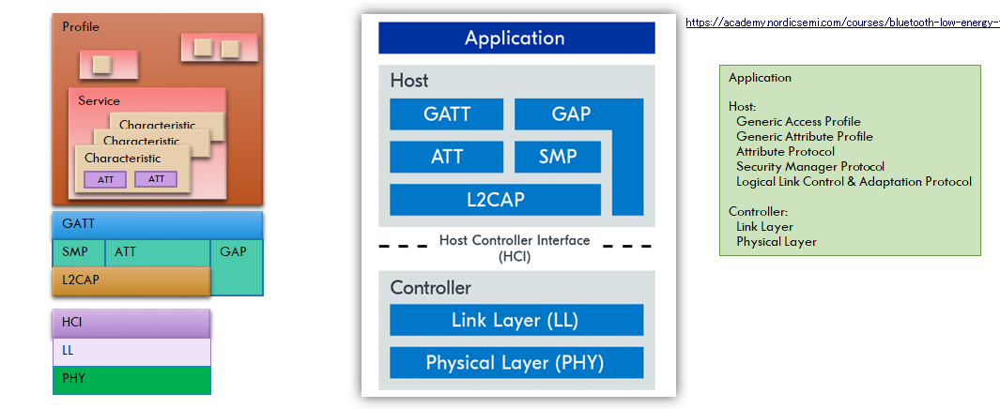

# BLE基礎 (1)

<i>2024/08/05</i>

そろそろ BLEの勉強もしていこう。

当時は nRF51822 をメインで使っていて、iBeacon や EddyStone みたいなペアリングなどが不要なタイプが有名だったような。
ただ Eddystone はそこまでメジャーにならなかったような気がする。
今も生きているのだろうか？

[【サルでもわかるBLE入門】（３） BLEビーコンの基礎 - 株式会社ムセンコネクト](https://www.musen-connect.co.jp/blog/course/trial-production/ble-beginner-3/)

なるほど、ジャンルとしては「位置測位」になるのか。  
しかし最近は「UWB(Ultra Wide Band)」という別周波数もある。
あまり覚えていないが、USBの無線の時にもそういうのがなかったっけ。なんでも無線化しようとしていたのにUSBは Wireless USB というロゴまで作られていたにも関わらずまったく進まなかったという記憶だけある。

[Wireless USB - Wikipedia](https://en.wikipedia.org/wiki/Wireless_USB)

それはともかく。  
今回 BLE を学び直すか、新たに UWB に進路を切り替えるかでけっこう悩んだのだが、UWB の情報が少ないので BLE から着手することにしたのだった。
UWB の開発ボードがあるかどうかもわからなかったし。

[超広帯域無線（UWB）通信  -  Connectivity  -  Android Developers](https://developer.android.com/develop/connectivity/uwb?hl=ja)

----

回想はここまでにして、BLE の復習をしよう。
今こそ DevAcademy(BLE編)の出番である。

## [What is Bluetooth LE?](https://academy.nordicsemi.com/courses/bluetooth-low-energy-fundamentals/lessons/lesson-1-bluetooth-low-energy-introduction/topic/what-is-bluetooth-le/)

昔作った図があったので一緒に載せておこう。
GATT が Hostブロックの一番上を覆っているが、Nordic の図は GATT と GAP が同じくらいの立ち位置になっている。
Nordic の図は昔からこうなので、私が何か思ってそういう図にしたのだろう。まったく記憶にない。
再履修している間に理解できたら描き直そう([描き直し](./20240820-ble.md))。

ncs には Zephyr の Bluetooth Controller と Nordic に以前からある [SoftDevice Controller](https://developer.nordicsemi.com/nRF_Connect_SDK/doc/latest/nrfxlib/softdevice_controller/README.html#softdevice-controller) が提供されているそうだ。
nRFシリーズに最適化されている SoftDevice の方を推奨している。
推奨ということは Zephyr のコードでも動かせるようになっているのだろうか。
[Using BlueZ with Zephyr](https://docs.zephyrproject.org/latest/connectivity/bluetooth/bluetooth-tools.html#id3)という記事もあるし、Zephyrのエミュレート環境もありそうだったので、なにかしら動かせるのだろう。
深追いはすまい。

## [GAP: Device roles and topologies](https://academy.nordicsemi.com/courses/bluetooth-low-energy-fundamentals/lessons/lesson-1-bluetooth-low-energy-introduction/topic/gap-device-roles-and-topologies/)

GAP は アプリから見た Bluetoothスタックの一番下になる。
ここには advertising や接続などを制御するパラメータが含まれている。

### Roles

GAPでの"role"は connection するかしないかで分かれる。
雰囲気的にはサーバーとクライアントのような感じだ。

昔描いた図から持ってきた。  
GAP の "Central" と L2CAP の "Master"、GAP の "Peripheral" と L2CAP の "Slave" は対応しているそうだ。  
GATT の "Server" は値を提供する方だったと思う。ATTごとにあるんだったか？ 例えば温度センサーが搭載されたデバイスでは温度はデバイス側が提供するので "Server" になっていたと思う。

#### connectionする

"Central" か "Peripheral" である。

大ざっぱにいえば、デバイスはほぼ Peripheral でその反対側は Central になる。
PCやスマホなんかは Central だろう。

#### connectionしない

"Observer" と "Broadcaster" である。

Advertising のデータに何かを載せて送りっぱなしな方と、それを受け取るだけの方。iBeacon などを想像するとわかりやすいか。  
connection する通信の場合は advertiseのデータを受け取ると接続しようとするが、このタイプの場合は接続しない。

#### multi-role

どっちにもなれるということを説明したいのだろう。  
小さいデバイスの場合は Peripheral か Broadcaster のどちらか単独な場合がほとんどではなかろうか。
nRF53 くらいになると並列でやれたりするんだろうか。

## [ATT & GATT: Data representation and exchange](https://academy.nordicsemi.com/courses/bluetooth-low-energy-fundamentals/lessons/lesson-1-bluetooth-low-energy-introduction/topic/att-gatt-data-representation-and-exchange/)

私の中では、BLE といえば GATT というか ATT というか、属性テーブルを作るのが作業の半分くらいを占めると思っている。
ちょっとした内容ならまだしも、あーでもないこーでもないと考え始めると時間がかかってしまうからだ。
単に慣れていないだけかもしれない。

1つの "Profile" の中に1つ以上の "Service" があり、さらにその中に1つ以上の "Characteristic" がある。

Service は複数ある。
例えば[これ](https://software-dl.ti.com/lprf/simplelink_cc2640r2_latest/docs/blestack/ble_user_guide/html/ble-stack-3.x/gatt.html#sbp-attr-table)だと赤っぽいのが Service で、そこから次の Service までが属する Characteristic になっている。
いくつかの Service は必須だったような気がする。

BLE通信でデータのやりとりをする場合、基本的には Attribute に書き込むなり読み込むなりすることで行われる。
私が図でGATTを上の方に持ってきたのも、たぶんそのせいだろう。

Profile や Service は[定義済み](https://www.bluetooth.com/specifications/specs/)のものもあるし、必要なら自作しても良い。
既存のものが使えそうだったら使った方がアプリとしても楽だろう。

## [PHY: Radio modes](https://academy.nordicsemi.com/courses/bluetooth-low-energy-fundamentals/lessons/lesson-1-bluetooth-low-energy-introduction/topic/phy-radio-modes/)

物理層。

[Bluetooth 5 - hirokuma](../05/20240518-bl5.html)

BLE が出た頃は 1M だけだったが、Core 5 からは 2M が追加された。
単位は Mbits/sec。
BLE 5.0 ではなく Bluetooth 5.0 だ。

倍になると、通信時間が短く済むので消費電力削減に効果があるが、受信感度が低下し通信距離も短くなるそうだ。
周波数に変わりは無いと思うので、単純にデータが拾いにくくなるのだろう。

そして Coded PHY というのも追加された。
BLEのみだから LE Coded PHY とも呼ばれるのか。
BLE 4.0 が 350メートルなら BLE 5.0(Coded PHY)は 500メートルとか書いてあった([Bluetooth_5-FINAL.pdf](https://www.bluetooth.com/bluetooth-resources/bluetooth-5-go-faster-go-further/))。

しかし 2M で距離を犠牲にして速度を上げることができるんだったら、Coded PHY は速度を犠牲にして距離を伸ばしたってことだろうか？

[【超入門】注目のBLE長距離通信機能『Coded PHY/Long Range』を学ぶ - 株式会社ムセンコネクト](https://www.musen-connect.co.jp/blog/course/trial-production/coded-phy-basic/)

Coded PHY はいくつかレベルのようなものがあるようで、S=2 だと距離は倍で速度は半分、S=8だと距離は4倍で速度は4分の1、というようなイメージだそうだ。

それに対応した相手じゃないと使えないので、スマホを相手にとかはちょっと使いづらいというか時代がまだ早いというか。

にしても、BLE ってそもそもが何百メートルも飛ぶものなんだな。
