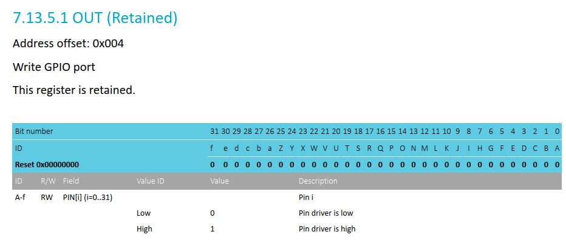

# ncs: ボード定義の見直し

<i>2024/09/10</i>

少し ncs への理解が深まった気がするので、nRF5340 の MDBT53ボード用に作った環境を整理する。

* [ncs-custom-board](https://github.com/hirokuma/ncs-custom-board/commit/1bb1131f67296a47e47762ee81978598632d9dfd)
  * QSPI を使用しないのを overlay の方で表現していたが、common.dtsi から `"status"`の記述を外せば良いことに気付いた
  * QSPI, GPIO forwarder, ADC, I2C1, UART0, SPI3, SPI4, IEEE802154 を外した
* 各overlayサンプル
  * `usbd`を有効にするのは USB関連の定義だけにする
  * `uart0`の有効化を common.dtsi からここに移動
  * `i2c1`も有効にした
  * `leds`に`compatible`を追加
    * 効果があるのか分からん

前回作った SB1602B 液晶サンプルも更新。

* [commit](https://github.com/hirokuma/ncs-i2c-sb1602b/commit/82c652ca38a9ab9ea2b7a2390448e59dc44df161)
  * overlayサンプルを更新
  * 未初期化の LED を OFF
  * `main()`の整理

DeviceTree で GPIO output の初期値くらいは設定できそうな気がするのだが、内部プルアップ/プルダウンはあるものの値についてはなさそう。  
しかしデジタルな出力なのだから最初は `0` か `1` のどちらかになるはず。  
これからすると `0` のはずだ。

実際には `gpio_pin_configure_dt()` なんかで設定をしないと反映されない。
つまり、DeviceTree の設定はデータとして持っているだけで、初期化のタイミングは実装者がやるようになっているのだ。
まあ、`main()`までに必ず初期化される、とかなっていると困ることもあるだろうし、仕方ないか。

とはいえ `gpio_pin_configure_dt()` を使うには、

* `DT_ALIAS()` などで ID を取ってきて、
* `GPIO_DT_SPEC_GET()` などで `struct gpio_dt_spec` のインスタンスを持ってきて、
* `gpio_pin_configure_dt()` などで初期化

と面倒だ。  

面倒なのはまだよいとして `struct gpio_dt_spec` のインスタンスを保持しておくのはもったいない。
[struct gpio_dt_spec](https://github.com/nrfconnect/sdk-zephyr/blob/v3.5.99-ncs1-1/include/zephyr/drivers/gpio.h#L286-L293)はメンバーが3つだけなので、`const struct device*` の先が一番大きいデータになりそうだ。  
アドレスをログに出してみたが `0x6284` と Flash のアドレスだった。
つまり、DeviceTree の設定は Flash にあらかじめ保存されているから RAM の心配はしなくてよいのだ。

そうなると今度は、GPIO のピン 1つに 1つの変数を持っておくというのが煩わしくなってくる。
そもそもデバイスドライバという階層があるのだから GPIO も単独で操作することはないので、煩わしいのはデバイスドライバの実装だけである。

それなら・・・これくらいはもうよいような気がしてきた。  
GPIO を直接操作したいのは LED や SW を除いたらリセットの制御のようにデバイスを制御したいときだから、1つのデバイスに対してたくさん必要になることが少ないだろう。

### dk_buttons_and_leds

そういえば DevAcademy で使われている `dk_buttons_and_leds` ライブラリは複数の LED を制御していたがどう実装されているのだろうか。

[LEDのDeviceTree設定配列](https://github.com/nrfconnect/sdk-nrf/blob/v2.6.1/lib/dk_buttons_and_leds/dk_buttons_and_leds.c#L41-L45)をつくって[まとめて初期化](https://github.com/nrfconnect/sdk-nrf/blob/v2.6.1/lib/dk_buttons_and_leds/dk_buttons_and_leds.c#L195-L201)で1つずつ`gpio_pin_configure_dt()`で呼び出している。  
単独で設定するときは[dk_set_led()](https://github.com/nrfconnect/sdk-nrf/blob/v2.6.1/lib/dk_buttons_and_leds/dk_buttons_and_leds.c#L377-L390)を使うし、まとめて設定するときもそのDeviceTree設定配列を`for`でぐりぐり回すだけである。  
`DT_PATH()`と`DT_FOREACH_CHILD()`を使うところ以外は素直だと思う。

### LED

見ていて気付いたが [Light-Emitting Diode (LED)](https://docs.nordicsemi.com/bundle/ncs-2.6.1/page/zephyr/hardware/peripherals/led.html) というドライバがあった。  
LED だけなのに大げさな、と思ったが、RGB だったり matrix だったりと単なる ON/OFF だけの LED ではないようだ。  
[zephyr/drivers/led/](https://github.com/nrfconnect/sdk-zephyr/tree/v3.5.99-ncs1-1/drivers/led)にもファイルがたくさんある。  
[GPIO](https://github.com/nrfconnect/sdk-zephyr/blob/v3.5.99-ncs1-1/drivers/led/led_gpio.c) を見ても brightness なんて文字もあるし、立派な?LED 用なのだろう。

## デバイス制御への理解を深めるために

いろいろ知識が足りていないことが分かった。  
アプリだけでなくデイバス操作もすることを考えると、DevAcademy Intermediate も進めるべきか。

[nRF Connect SDK Intermediate](https://academy.nordicsemi.com/courses/nrf-connect-sdk-intermediate/)
