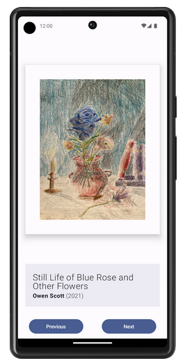
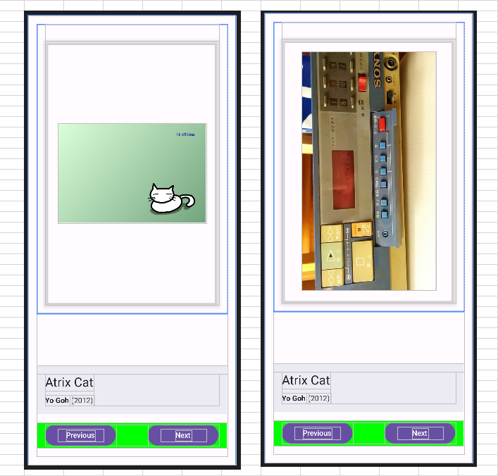
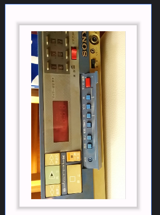
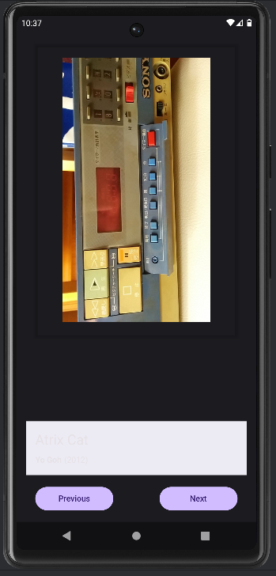

# android: やはりレイアウトは難しい

<i>2024/10/15</i>

もはや愚痴である。

いま、Android の Codelabs で ユニット2(アプリUIを作成する)のパスウェイ3(UIと状態を操作する)をやっている。  
ようやく最後の項目だ。

* [アートスペース アプリを作成する](https://developer.android.com/codelabs/basic-android-kotlin-compose-art-space?hl=ja&continue=https%3A%2F%2Fdeveloper.android.com%2Fcourses%2Fpathways%2Fandroid-basics-compose-unit-2-pathway-3%3Fhl%3Dja%23codelab-https%3A%2F%2Fdeveloper.android.com%2Fcodelabs%2Fbasic-android-kotlin-compose-art-space#1)

こういうのがレイアウト的な目標である。



ようやくできてきたのがこちら。  
領域がわかりやすいように変な色を付けているが、下の方は落ち着いてきた。  
問題は上側だ。


```kotlin
    Column(
        horizontalAlignment = Alignment.CenterHorizontally,
        verticalArrangement = Arrangement.Center,
        modifier = modifier
            .padding(16.dp)
            .shadow(elevation = 4.dp, shape = RectangleShape)
            .width(400.dp)
            .height(500.dp)
    ) {
        Image(
            painter = painterResource(id = art.image),
            contentDescription = stringResource(id = art.title),
            modifier = Modifier
                .width(300.dp)
                .height(500.dp)
                .background(color = Color.DarkGray)
                .align(alignment = Alignment.CenterHorizontally)
                .wrapContentSize(),
            contentScale = ContentScale.Crop
        )
    }
```

* 上側の構成
  * `Column`
    * `Image`
* 影が付いたような枠になっている。これは `Modifier.shadow()`が使える
  * Codelabs のヒントに `Elevation` という単語が出てくるが、`.shadow(elevation=X.dp)`で Z軸方向の高さがあるような効果を得られる
  * `Column`に設定している
* `Image` が `Column` をはみ出している
  * これは `.shadow()` でつけた影が `Column` の内側になっているからだろう
  * `Column`と同じ`.height`になっているのもよくない
* [ContentScle.Crop](https://developer.android.com/reference/kotlin/androidx/compose/ui/layout/ContentScale#Crop())はアスペクト比を維持するようだったが付けていたが、

うーん、難しく考えすぎたか？  


```kotlin
    Column(
        horizontalAlignment = Alignment.CenterHorizontally,
        verticalArrangement = Arrangement.Center,
        modifier = modifier
            .padding(16.dp)
            .shadow(elevation = 4.dp, shape = RectangleShape)
            .width(400.dp)
            .height(500.dp)
    ) {
        Image(
            painter = painterResource(id = art.image),
            contentDescription = stringResource(id = art.title),
            modifier = Modifier
                .padding(24.dp)
                .background(color = Color.DarkGray)
                .align(alignment = Alignment.CenterHorizontally),
        )
    }
```

* 横長でも縦長でも収まっている。
* `Column` で `horizontalAlignment` があるので `Image` の方には水平位置指定が不要
* `Column` の `modifier`
  * `padding` は外側に対する余白
  * `shadow` は影
  * `width` と `height` を指定して



レイアウトの線があるとわかりにくいが、影はこんな感じ。  
左上から照らしたようにしたかったがそういう指定はなさそう？



### ダークモード

エミュレータで動かしてみると、それはそれでまだ足りないところがあった。  
その中で一番大きいのはダークモードだった。



色を特別に指定したりしなければうまいことやってくれるのかと思ったけどそうじゃないのね。。。

もうこの程度でレイアウト関係は止めにしようと思ったのだが、ダークモードで文字が見えないというのはさすがにダメだ。  
レイアウトの道は長いなあ。

[Jetpack Compose のテーマ設定](https://developer.android.com/codelabs/jetpack-compose-theming-m2?hl=ja#0)

### おまけ

[Modifier](https://developer.android.com/reference/kotlin/androidx/compose/ui/Modifier) のページが重たい。  
しかも、ソースコードから抜粋した順になっているためか名前がアルファベット順になっていない。

