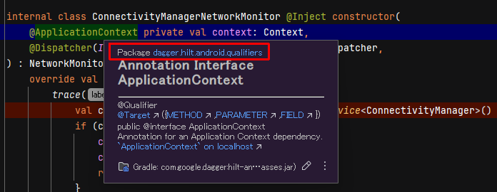

# android: compose で system service はどこでもらうか

<i>2024/10/22</i>

前回で ViewModel を使うところまでチュートリアルを動かしたので、また BLE 操作のアプリ作成に戻る。  
じっくりやっても身につく気がしないので、今は作ってみるときだ、と判断した。  
まあ、そうじゃなかったら調べれば良いだけだ。

## BluetoothLeScanner

* [BLE デバイスを探す  -  Connectivity  -  Android Developers](https://developer.android.com/develop/connectivity/bluetooth/ble/find-ble-devices?hl=ja)

Android での BLE機器のスキャンは OS バージョンで変わってくるのでめんどくさい。

 最終的には [BluetoothLeScanner](https://developer.android.com/reference/android/bluetooth/le/BluetoothLeScanner) を使う。  
そのために `BluetoothLeScanner` のインスタンスがいるのだが、説明に書いてあるように `BluetoothAdapter#getBluetoothLeScanner()` を使う。  
そして [BluetoothAdapter](https://developer.android.com/reference/android/bluetooth/BluetoothAdapter) もインスタンスがいるのだが、これも説明に書いてあるように `BluetoothManager.getAdapter()` を使う。  
[BluetoothManager](https://developer.android.com/reference/android/bluetooth/BluetoothManager) もインスタンスが必要で、これは `Context.getSystemService()` で取得する。

`Context.getSystemService()` は Android のサービス系の機能を使いたいときにはだいたい出てくる。  
今回は Bluetooth なので Kotlin だと `getSystemService(BluetoothManager::class.java)` のような呼び出し方になる。  
そしてこの `getSystemService()` をどこで呼び出すのが良いんだろうか、というのが今回の話題である。

ちなみに Kotlin だからか `.getAdapter()` みたいなメソッドは `.adapter` とプロパティになっていることが多い。  

## Context

### Activity

Context の大元は `Activity` だろう。  
アプリを Android Studio のウィザードで作った場合は `MainActivity` という名前になっている。  
その中のメソッドであれば `getSystemService()` だけで呼び出すことができる。

ただ Compose で画面を作っているので `Activity` にお願いするのもなんだかなぁ、と思ってしまう。  

### Composable

`@Composable`関数の中では `LocalContext.current` で現在の `Context` を取得できるようだ。  
なので `LocalContext.current.getSystemService()` で呼び出せる。

まあ、これはこれで仕方ないとあきらめても良い気もする。  
ただ BLE にアクセスするのはさらに下の階層なので、`ViewModel` を使うにしてもそこに与えないといけない。  
コンストラクタで与えるべきか、`ViewModel` に設定するメソッドを追加するか悩ましい。

### ViewModel

Android のアプリアーキテクチャに沿うならば BLE のアクセスは `ViewModel` の仕事ではないだろう。  
[Data Layer](https://developer.android.com/topic/architecture/data-layer?hl=ja#common-tasks)がネットワークやデータベースにアクセスしてデータを取得するなら、BLE の機器一覧を取得する機能も Data Layer だと思う。  
まあ、そんなに堅苦しく考えなくてよいとは思うが今回はアプリアーキテクチャの勉強でもあるので。

なので、`BluetoothLeScanner` を Composable --> ViewModel --> Repository --> Data Source、と伝えないといけない。  
データベースやインターネットが追加されたら、それらも同じようなことになるだろう。  
そう思うと下の方には `Context` を渡して `getSystemService()` を実行するのは下の方に任せてもいいんじゃないの、と思ったのだ。

### サンプルを見る

[アプリアーキテクチャのサンプル](https://developer.android.com/topic/architecture?hl=ja#samples)があるので、これを見る。

* [architecture-templates/app/src/main/java/android/template/data/local/di/DatabaseModule.kt](https://github.com/android/architecture-templates/blob/c52e325d74b42379d41723a692f3b0e21fb86755/app/src/main/java/android/template/data/local/di/DatabaseModule.kt)

たぶん Data Layer か Data Source のどちらかだろう。  
[MyModelRepository.kt](https://github.com/android/architecture-templates/blob/c52e325d74b42379d41723a692f3b0e21fb86755/app/src/main/java/android/template/data/MyModelRepository.kt) はいるので Data Source かな？  
ただこのクラスは定義はあるもののテンプレートでは使われていない。

github.com/android を探してようやく `getSystemService()` を下の方で使っている例が見つかった。

* [apps/nowinandroid/core/data/util/ConnectivityManagerNetworkMonitor.kt](https://github.com/android/nowinandroid/blob/ecea15d3e40643397e0cd5bcec6811ac10c3bb66/core/data/src/main/kotlin/com/google/samples/apps/nowinandroid/core/data/util/ConnectivityManagerNetworkMonitor.kt#L47)

このコードも呼ばれている感じがしない。  
`context` に付いている `@ApplicationContext` や `@Inject` は Hilt という依存関係インジェクションなるものに関係するらしい。

```kotlin
internal class ConnectivityManagerNetworkMonitor @Inject constructor(
    @ApplicationContext private val context: Context,
    @Dispatcher(IO) private val ioDispatcher: CoroutineDispatcher,
) : NetworkMonitor {
    override val isOnline: Flow<Boolean> = callbackFlow {
        trace("NetworkMonitor.callbackFlow") {
            val connectivityManager = context.getSystemService<ConnectivityManager>()
            ...
```



DI というらしいが、なんだこりゃ？

### Hilt

Dependency Injection のことらしい。  
delegation のように引数で与えるのは「手動」というやり方だそうな。  
それに対してライブラリを使うやり方があり、[Hilt](https://developer.android.com/training/dependency-injection/hilt-android?hl=ja) は `Dagger` という DIライブラリを使った Android ライブラリ。

* [Android アプリでの Hilt の使用](https://developer.android.com/codelabs/android-hilt?hl=ja#0)

Compose じゃないので私にはちょっとつらい。  
雰囲気は分かる気がするのだが、たとえば `Context` を注入するのに `@ActivityContext` をコンストラクタの引数に書いていた場合、`@AndroidEntryPoint` な `Activity` からうまいこと `Context` を引っ張ってきてあたかも引数で与えたかのように振る舞ってくれるというととだろうか。

* [Hilt と Dagger のアノテーションのクイック リファレンス  -  Android Developers](https://developer.android.com/training/dependency-injection/hilt-cheatsheet?hl=ja)


`@ActivityContext`がよいのか`@ApplicationContext`がよいのかはぱっと判断できない。  
BLE はデバイスに紐付くからどっちでもよいと思うと `@ApplicationContext` の方が意味がわかりやすいかしら。

が、そもそも Hilt がよくわからないので試したい。  
`@ApplicationContext`は本当に思ったように動作するのかとか、`@ApplicationContext`じゃないパラメータでそっちは Hilt で注入するようにしてなかったらどうなるの、とか。  
BLE でいきなり試すのは挙動が分からなさすぎるので、より手前の `ViewModel` が確認しやすいだろう。  
幸い `ViewModel` についても `@HiltViewModel` という [annotation が用意されている](https://developer.android.com/training/dependency-injection/hilt-jetpack?hl=ja#viewmodels) ので

`@HiltViewModel`と`@Inject`(`javax.inject.Inject`なんだね)を付けてビルド。
ライブラリや`@AndroidEntryPoint`などは付けているのだがエラーになる。  

> [Dagger/MissingBinding] android.content.Context cannot be provided without an @Provides-annotated method.

自作 ViewModel のコンストラクタ引数が `Context` なのだがよろしくないのか。
引数が`Int`でもダメで、引数無しだとビルドできる。  
どうもパラメータが付くと対応がいるらしい。

* [中途半端にDIしたい ▶︎HiltのAssisted Injectを使う](https://zenn.dev/tbsten/articles/26a45bc1347c7a#viewmodel%E3%81%ABassistedinjection%E3%81%99%E3%82%8B%E6%99%82%E3%81%AE%E6%B3%A8%E6%84%8F)
* [Jetpack Compose + HiltでViewModel生成時にパラメータを渡す #Android - Qiita](https://qiita.com/nkshigeru/items/54a07ba1ce03bf24716f)
* [viewModels](https://dagger.dev/hilt/view-model.html)

`hiltViewModel` とか `viewModels` とか小文字始まりのが出てくるのだけど、私のところで解決できない。。。
どうも "androidx.hilt:hilt-navigation-compose" を implementation しないと使えないようだ。

これで Gradle Sync はできるようになったのだが、どうにもビルドエラーになる。  
"kspDebugKotlin" だの "already registered" だの "internal error" だの別の要因な気がする。  

* [android - Issue: java.lang.IllegalStateException: Storage for \[...\] is already registered When Adding Type Converters with KSP - Stack Overflow](https://stackoverflow.com/questions/78975729/issue-java-lang-illegalstateexception-storage-for-is-already-registered)

2番目の回答のように `gradle.properties` に `ksp.incremental=false` を追加したら直った。  
PC を再起動とかでももしかしたら直ったパターンかもしれない。  
よくわからん。。。

まだ ViewModel のコンストラクタを `Int` にしたままだったので `Context` に戻す。  
そうするとコンパイルエラーが。。。


今日はおしまい。

## おまけ

### テンプレートのカスタマイズ

* [architecture-templates: baseブランチ](https://github.com/android/architecture-templates/tree/base)

このテンプレートのカスタマイズスクリプト `./customizer.sh your.package.name DataItemType [MyApplication]` だが、`MyApplication` はファイル名やクラス名として使われるようなので変な名前にしないよう気をつけよう！

あと、AGP のバージョン [androidGradlePlugin](https://github.com/android/architecture-templates/blob/base/gradle/libs.versions.toml) が現在の最新になるようで [Android Studio](https://developer.android.com/studio) の安定版だとビルドできないかもしれない。  
これを書いている時点で私は "Koala Feature Drop | 2024.1.2" を使っていて AGP は 8.6.0 だがテンプレートは 8.7.0 だった。
