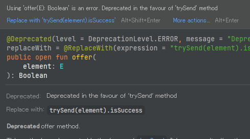
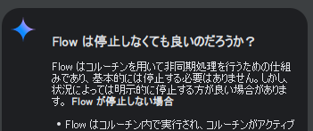

# android: テンプレートの BLE Serivceを改造しよう

_2024/11/19_

Data Sources がどうあるべきかはよくわかっていないが昨日考えた方針に沿って改造しよう。  
数日前に「完了とする」といったのはなんだったのか。。。

* 改造元
  * [agp-8-ble-0.0](https://github.com/hirokuma/hk-architecture-templates/tree/agp-8-ble-0.0)

* 主な改造内容
  * BLE を扱う 1 つの Data Sources にする
    * といっても 1 つの `class` などにするというつもりはなく、実装単位として 1 つにする
      * スキャン
      * 接続
        * 各サービス
    * 同じ package にまとめておけば、1 つの `class` にしたいとかでもやりやすかろう(たぶん)
  * BLE の結果はコールバックで返ってくるので `Flow` 系に置き換える
  * とりあえず `suspend` を付けておく？
    * コールバックで結果が返ってくるので意味は無いと思うが、それでも付けた方が良いのか？
    * 中に `suspend` を呼び出さないので Android Studio が「いらない」といってるから、いらないのかなあ

方針というには弱いが、よくわかっていない改造の第1弾なんてそんなもんだ。

## スキャン

* [作っていたスキャン](https://github.com/hirokuma/hk-architecture-templates/blob/agp-8-ble-0.0/app/src/main/java/android/template/ui/screens/BleViewModel.kt#L75-L132)
  * とりあえずだったので ViewModel に突っ込んでいた
  * コールバックで `List` に追加する(新規アドレスのみ)
  * 追加した `List` は `MutableStateFlow` の中にあるので、追加したら UI に反映される

ViewModel 内に置いていたので楽していたところを `Flow` で通知する形にする。  
コールバックをそのまま `Flow` にする場合は `callbackFlow`(小文字始まりのキャメル) が向いているそうだ。  
検索するとやりたいことそのままっぽい記事があった。

* [BLEデバイスのスキャンをkotlin coroutineのcallbackFlowでやる #Android - Qiita](https://qiita.com/cnaos/items/c5e40ea7d1ec85a03791)

`callbackFlow` にする方はちょっとした改造で済む。  
ああ、最初は `awaitClose` を書いていなくてアプリが死んだので悩んだ。  
これは logcat に出ていたので気付きやすいかもしれないが、原因が書いてあるところを探すのに苦労した。  
`Flow` で送りつけるなら `trySend` と思っていたが `offer` というのもあるのか。  
と思ったら `offer` が deprecated になって `trySend` を使え、となったらしい。

Android の API もしょっちゅう deprecated になるけど Java 系だと普通なんかね。  
GATTのコールバックなんて `value` が付いただけでそんなに変わらんのに(ぶつぶつ)。。。

`callbackFlow` を受け取る方は `Job` なるもので `viewModelScope.launch` を受け取るようにできるそうだ。  
[Flowからの収集](https://developer.android.com/kotlin/flow?hl=ja#collect) のように `.collect{}` で受けた方が他の `Flow` と同じように扱えて良いかも？  
ただ `Job` にすると `Job` のキャンセル呼び出しによって `awaitClose` が呼び出せるのかも。  
そうするとスキャンの API として停止を公開する必要がなくなる。  
Android のスキャン停止 API は引数にスキャン開始で使ったのと同じ引数(callback関数)を指定しないとスキャンが止まらないようなので、スキャンの開始と停止の API を用意すると callback 関数を共通で扱えないといかんようなのだ。  
まあメンバ変数？フィールド？プライベートプロパティ？で持てば良いだけではあるが。

今さら思ったが `Flow` は使い終わったら停止させなくて良いのだろうか。  
コルーチンになって変化があれば通知するってことはリソースを何かしら食ってるだろう。  
ViewModel とか Data Sources だとそんなにバンバン生成するわけでもないから見逃されるのかな？  
参照元がなくなったのがわかりやすくてガベッジコレクションによって回収されるのか。  
[Flow<T>.cancellable()](https://kotlinlang.org/api/kotlinx.coroutines/kotlinx-coroutines-core/kotlinx.coroutines.flow/cancellable.html) というのはあるが `ShadowFlow` 以外はデフォルトではキャンセルできるようになっていないということだろう。  
んー、よくわからんな。こういうときは Gemini 先生だ。

止めるときは `Job` に対して `.cancel()` を呼ぶことらしいが、まあ止めなくても良いのだったら放置で良いのかな。  
`Flow` を提供する方では制御できないので `awaitClose` でスキャンを停止するようにだけしておけばよかろう。

## 接続

### 接続と切断

スキャンして通知された `BluetoothDevice` を保持しておけば BLE接続できる(もちろん相手が生きていればだが)。  
接続したらとりあえずサービスなどをスキャンして相手が期待通りのプロファイル(定義してないけど)なのかを確認している。  
ペアリングなどはまだない。今後の課題だ。

接続は Central から要求を行うが、切断については Central から要求する場合もあるし、Peripheral が切断することもある。
通信が途切れて切断してしまうこともある。  

UI の話になるが、切断ボタンを用意するのはよいとして、操作で「戻る」することも考えないといけない。  
接続画面で戻るイベントを検知したら BLE切断させ、BLE切断を `StateFlow` で検知したら戻るようにしているつもりである。

* [BackHandlerで切断](https://github.com/hirokuma/hk-architecture-templates/blob/agp-8-ble-0.0/app/src/main/java/android/template/ui/screens/ConnectedScreen.kt#L86-L88)

まあ、切断しなくても戻るようにしたり、切断しても画面を戻らないようにしたりというのもあるだろうから、ここは私の趣味だと思っておくれ。  
ともかく Data Source としては切断を通知する機能がいるという話をしたかっただけだ。

### コールバックをどうするか

BLE 接続および接続後に行ったあれこれの通知は `BluetoothGattCallback` に対して行われる。  
GATT といいつつも、たぶん HCI とか L2CAP のエラーも来ているんじゃないかと思う。
まあ、それらは GATT の階層だから返す箇所がないのでやむなくかもしれんが  
[GATT Error Codes](https://blog.hirokuma.work/nrf/gatt_error_codes.html) に調べた範囲では書いたのだが、そこに載っていないエラー値(`status`)が返ってくることがあるのだ。

あ、ヘッダファイルから探したけど [BluetoothStatusCodes](https://developer.android.com/reference/android/bluetooth/BluetoothStatusCodes) なのか？  
でもこの class は API 31 での追加だから API 26 以降にしていると使えないか。  
私が見たのは BLE 接続に失敗したときで値は `22` だった。  

* `BluetoothStatusCodes.ERROR_LOCAL_NOT_ENOUGH_RESOURCES`(hideになってる)
  * Indicate that there is not enough local resource to perform the requested operation
* [GATT_CONN_TERMINATE_LOCAL_HOST](https://android.googlesource.com/platform/external/bluetooth/bluedroid/+/master/stack/include/gatt_api.h#110)
  * `HCI_ERR_CONN_CAUSE_LOCAL_HOST`
  * 0x16 connectionterminated by local host

標準のエラー値ではないのでよくわからないな。  
コールバックに話を戻そう。

スキャンの場合は見つけたデバイスを通知するだけだったので気にしなかったが、
Characteristic への操作結果は接続時の `BluetoothGattCallback` に返ってくるので
そのまま上に返しても使いづらいだろう。

接続と切断については `callbackFlow` で返す。  
それ以外のサービスごとの結果についてはそれぞれ `callbackFlow` なり `StateFlow` なりで返すのが良いのか？

## 今回の改造版

これらをテンプレートに反映した。

* [agp-8-ble-0.1](https://github.com/hirokuma/hk-architecture-templates/tree/agp-8-ble-0.1)

スキャンが ViewModel から移動し、`Navigation.kt` でやっていた `services` の生成も `data/ble/` に移動になったのですっきりしたように思う。  
UI から直接 Data Source にある class を操作していることになるが、それを止めるには Repositories やら ViewModel やらの変更がいるので BLE Service のテストという意味ではわずらわしい。

BLE Service のコードを機械的に作るなら、`ByteArray` をさばく階層がいる。  
GATTのテーブルを作るときにサイズは決めるが、Peripheral 側と同じで文字列だとかなんだとかは上位層が決めることだ。  
Android のこの構造だと Repositories でよいのかな？  
お手本がほしいねー。
