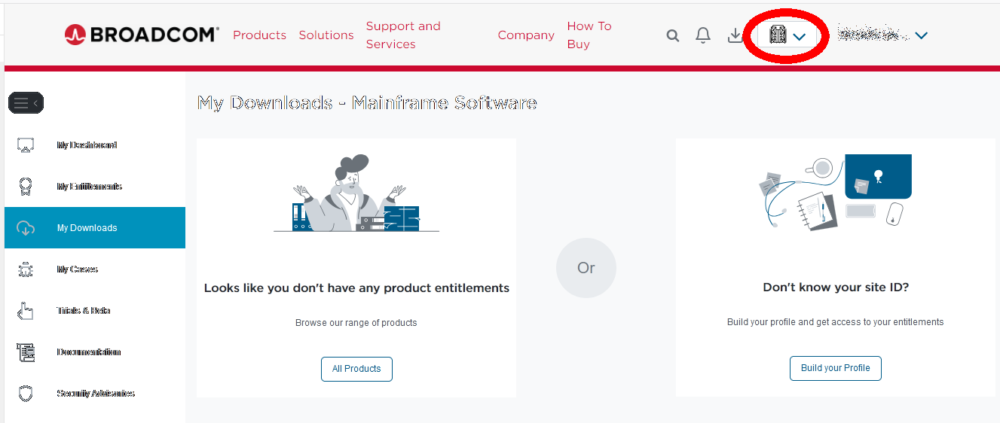
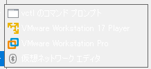
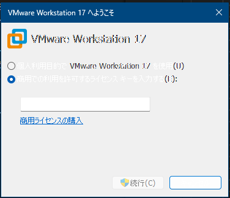
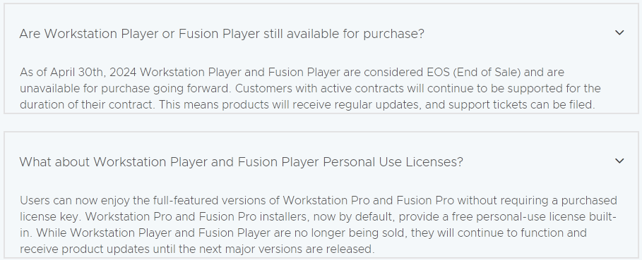
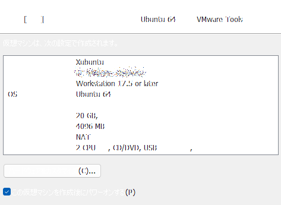
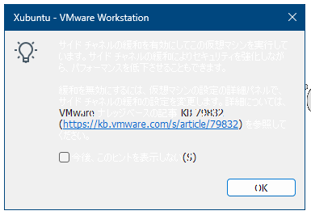
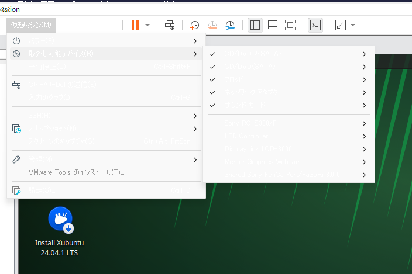
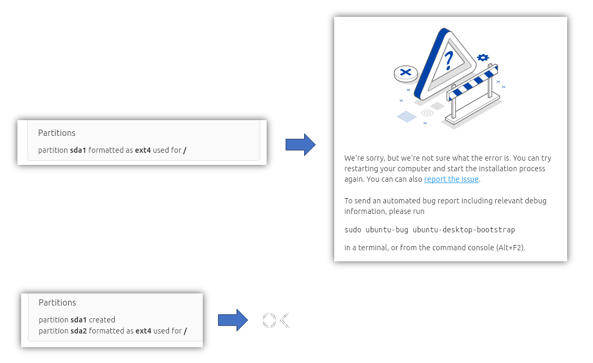
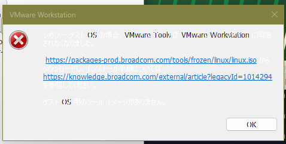
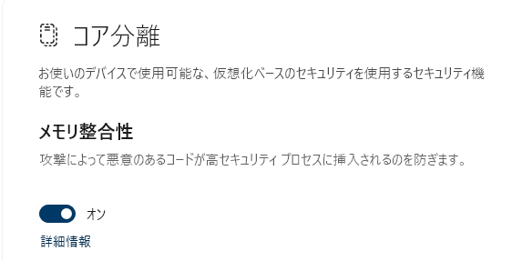

# vmware をインストールしてみよう

_2024/11/25_

今は Windows 11 で WSL2 を使っているが、その前までは VirtualBox を使っていた。  
vscode も使えるし文句はなかったのだが、最近は ncs をビルドするのに Linux の方がいろいろやりやすいことに気付いた。  
そしてビルドしたら実機へ転送するところまでやってしまいたい。  
一応 WSL2 でも USB を使うことについてはページがあったのだけど、なんかこう不安が残る。  
実際にやった人もいるので大丈夫だとは思うのだが。

* [Perfect SDK setup in WSL (almost) - Nordic Q&A - Nordic DevZone - Nordic DevZone](https://devzone.nordicsemi.com/f/nordic-q-a/108035/perfect-sdk-setup-in-wsl-almost)

## VMware Workstation Pro インストーラのダウンロード

せっかくなのでやった手順を書きはするが、他のサイトの方が説明がたぶん親切だと思う。

覚えていないくらい昔に作っていた vmware.com のアカウントは使えなくなっていた。  
Broadcom 用に作らないと何もできない。  
個人のメールアドレスでアカウントを作ったのでプロファイルの作成っぽいのはできなかったがアカウントは作成できる。

* [Desktop Hypervisor Solutions - VMware](https://www.vmware.com/products/desktop-hypervisor/workstation-and-fusion)

せっかくリンクを踏んだのだが、何も出てこない・・・。  
と思ったら、右上のコンボボックスから「VMware Cloud Foundation」を選ぶといろいろ出てきた。



「VMware Workstation Pro」が下の方にあるのでクリック。  
Windows か Linux の製品とバージョンが選べるので、今の時点で新しい "17.0 for Windows" をクリック。  
・・・するとさらにリリースバージョンが選べるので一番新しい 17.6.1 をクリック。  
ダウンロードできそうな画面に遷移するが、ボタンを押す前に少し上にあるチェックボックスにチェックして agree しないと進まない。  
[日本語版](https://docs.broadcom.com/doc/end-user-agreement-japanese)もあるのだが、60ページもある・・・。  
1つの契約書ではなく複数入っているのでこのページ数になっているようだ。  

* 1-22: Foundation Agreement(基本契約)
* 23-40: Software Module(ソフトウェア・モジュール)
* 41-52: Saas Module(Saasモジュール)
* 53-60: Services and Education Module(サービス及び研修サービスモジュール)

ダウンロードボタンをクリックすると、さらに情報入力を求められる。  
入力して Agree すると、今度こそダウンロードできる画面になってボタンをクリックするとダウンロードが始まる。
ファイルは 450MB くらいなのでそこまで時間はかからなかった。  
せっかくなので SHA2/MD5 でのハッシュ値比較もやっておくと安心だろう。  
といっても、サイトに書いてある値と一致するかだけの比較になるから、サイトがそもそも偽物だと意味が無い。  

### 安全かどうかどうやって確認するんだろう？

サイトが偽物かどうかは、証明書を見るしかなかろう。  
まあ、最近のブラウザならサイトと証明書が不一致なら警告してくるはずだ。  
このサイトは `support.broadcom.com` だったのだが、見た目がそう見えるだけのアルファベットではない文字を使っているだけかもしれない。  
証明書なんて改ざんされているかどうかのチェックにしか使えないのだ。  
PC だから比較的楽に調べられるが、スマホのブラウザだとちょっと厳しいと思う。

みんなどうやって確認しているんだろうか？  
サイト自体にウイルスとか情報を盗むとかのコードが入っていなかったら URL 先をチェックしてくれるツールとかでも無理なんじゃなかろうか。  
メールに載っているリンクとか怖くてタップしたくない。  
けど、間違ってタップする可能性もあるし、勢いでやってしまうこともある。

とりあえず、ブラウザセレクター的なアプリをインストールしてデフォルトブラウザをそれにしている。  
外部ブラウザを開くようになっていればワンクッション置くことになるので少し冷静に見ることができる(かもしれない)。  
ついでに Firefox Focus もインストールしているので、そちらで開けば Android OS とつながってそうな Chrome よりは情報が抜かれにくいだろう。

ダウンロードしたファイルは .exe で証明書付きだった。  
が、それを見たからといって「"Broadcom Inc" だ」くらいか。  
サイトの証明書と同じ DigiCert が発行しているな、くらいしか私には分からんのだ。  
もしかしたら同じ鍵で署名しているかもしれないが、そうじゃないことも多いと思うのよね。

まあ、このくらい見てわからなかったから、もういいかって気にはなる。

## VMware Workstation Pro のインストール

インストーラがあるので進めていくだけだ。

悩んだのはここ。  
確かに「Windows ハイパーバイザー プラットフォーム」はインストールしていなかった。  
VirtualBox を使わなくなったときにアンインストールしたんだったか？  


もう一方の「Device/Credential Guard」はなんだろうか。  
Windows11 22H2 ではデフォルトで有効になっているらしいが。

* [Configure Credential Guard - Microsoft Learn](https://learn.microsoft.com/en-us/windows/security/identity-protection/credential-guard/configure?tabs=intune)

[Verify](https://learn.microsoft.com/en-us/windows/security/identity-protection/credential-guard/configure?tabs=intune#verify-if-credential-guard-is-enabled)できるそうだが、
こういうとき困るのが日本語 Windows だと何という項目名になっているのかが分かりづらいところだ。  
`msinfo32.exe` のシステム概要で "Virtualization-based Security Services Running" らしいが、これは「仮想化ベースのセキュリティの実行中サービス」になるのか？  
見ると「ハイパーバイザーによるコードの整合性の強制」になっている。  
コマンドラインならわかるだろうと PowerShell の方をやってみたが、ページには 0 か 1 で書いてあるのに出力されたのは 2 だ。  
うちの Windows11 が 23H2 だからだろうか？

まあいいや、項目名が分かっているので後でアンインストールできるからやっておこう。  
Windows セキュリティの「メモリ整合性」はそのままでよいのだろうか。
VirtualBox のときはオフにしないとゲストOS が安定しなかったのだ。  
まあ、それも後で良かろう。

インストールが最後まで終わると、ウィザードを完了するからライセンスの入力をするかのボタンが出てきた。  
ライセンス？  
とりあえず押してみたが、入力するテキストバックスが出てきた。  
スキップもできるのでスキップ。  
特に怒られもせず完了できた。  
ハイパーバイザープラットフォームもインストールされていた。  
再起動を求められなかったのはありがたい。



## 使ってみよう

さっそく Workstation Pro を立ち上げてみよう。



あれー。  
画面のリンクをクリックしても「シャットダウンしました」ってサイトにつながるだけだ。

ダウンロードしたページに何か載っているかもしれない、と開いてみた。  
タブがあったので切り替えてみたところ、こちらにはライセンスファイルなるものがあった。  
そしてこちらはオープンソース版だ。が、バージョンがちょっと違う。  


VMware のオープンソース版が既にあるのだろうか？  
あるんだ。  
たぶん今回とは関係ない。。。たぶん。。。

* [VMware](https://github.com/vmware/)

2024年11月11日以降は個人利用でも制限がなくなり、購入はできなくなり、全員に Free だ、となっているなら商用利用であっても「個人」で進めていってよいということだろうか。  
FAQ 的なことだと思うのだよ。



別にいまは仕事で使うわけじゃ無いから個人利用でよいし、表示されている「商用」というのも既に購入していたユーザ向けのことだろうとは思うのだよ。  
ただ私は納得したいだけなんだー  
が、めんどくさいのも嫌なので、このまま進める。  
もしかしたら設定後は変化しているかもしれないと期待したが、そんなことはなかった。


取りあえず、何かゲストOS をインストールしてみよう。  
慣れている Xubuntu にした。

* [Download Linux - Linux.org](https://www.linux.org/pages/download/)




最近のは Live CD(だっけ)してインストーラをそこからたたくんだね！



これ以降はスクリーンショットを載せていても面白くないだろうから割愛する。  
「割愛」っていうのはいくつか意味があって、ここは残念だけど省略する、という感じで使っている。  
後から見返したとき、あのスクリーンショットがあれば、と思うことがあるのだよ。  
そのときには大したことないと思ってスルーしていることが多いので、残すに越したことはないのだが面倒なのも嫌なのだ。

VMware で事前に入力したユーザ名とかパスワードは使われなかった。  
これは Live CD になっているからだろうか。

パーティションを自分で作成したのだが、時間がかかった後にインストール失敗になってしまった。  
自動に任せると成功した。パーティションが 2ついるのか？



そして成功してゲストOSを再起動したのだが、黒い画面のまま何も表示されない。
もう一度再起動したら出てきた。なんなんだ。

### Xubuntu インストール後

VMware Tools をインストールしないとフルスクリーンにしたときでも画面サイズが小さいままだ。  

* [Installing VMware Tools](https://knowledge.broadcom.com/external/article?legacyId=1014294)

メニューからインストールを選んでもできない。  
Xubuntu は純粋な Ubuntu じゃないからレガシーって言われてるのか？



`linux.iso` はダウンロードできた。  
それをゲストOS の設定で CD/DVD っぽく読み込ませるようにする。  
ゲストOS に戻ってファイルシステムを確認するなりファイラーで見るなりして `linux.iso` をマウントさせる。  
そのマウントポイントは覚えておこう。

```console
$ cd /tmp
$ tar zxpf <マウントポイント>/VMwareTools-10.3.26-22085142.tar.tgz

# もう使わないのでumountしてよい

$ cd vmware-tools-distrib
$ sudo ./vmware-install.pl
```

あとは適当に答えていく。  
面倒なので全部 yes にした。  
CORE dump するのが気になるが

インストールが終わったのでゲストOSを再起動したのだが、また黒画面のままだ。  
もう一度再起動してもダメ。  
PC ごと再起動したのだがまた黒画面のままだ。  
なんなんだ。  
また Windows セキュリティのメモリ整合性関係か？



疲れたので今日はここまで。

----

_2024/11/26_

メモリ整合性をオフにしたが黒画面だ。  
昨日は 1 回だけ立ち上がったのだが今日はまだ成功していない。  
時間がかかっているだけなのか、グラフィックがダメなだけなのか、全然別な理由なのか。  
だいたい、Live CD であれば起動しているんだから  
ログファイルを見る。`linux.iso` が Program Files の中に無いようなことが書いていたので、いるかどうかわからんが VMware Tools 用にダウンロードしたファイルを置く。効果無し。  
VMware Player の方でインストールしてみたが、やはりダメ。  
インストール直後の再起動はうまくいくのだけど、その次に再起動するとダメなのよねぇ。

試しに Ubuntu の方を同じようにインストールした。  
こちらは起動する！  
なんでよ！！  
VMware Tools をインストールしても問題が無い。
試していないが、手動インストールではなくメニューからのインストールができそうな気がした(`linux.iso`をコピーしたからかもしれんが)。  
この調子ならメモリ整合性をオンに戻してもよいかもしれない。

## おわりに

VirtualBox は商用利用するなら Tools 的なものは外さないといけないというのを読んだ気がする。  
ずいぶん前にどこかの記事で見かけただけで確認もしていないので今は知らん。  

* [Licensing_FAQ – Oracle VirtualBox](https://www.virtualbox.org/wiki/Licensing_FAQ)
  * "PUEL" という非商用および教育向けのライセンス
  * 買うならたぶん[これ](https://shop.oracle.com/apex/f?p=dstore:product:25714122115624::NO:6:P6_LPI,P6_PPI:114347640102492137513432) だが、最低 100個からの購入のようだ。

そういう状況なので、あきらかに商用で使ってよいとうたわれていると安心するのだ。  
WSL2 も同じような理由で安心する。ただ純粋な Linux と言いきれないところに不安がある。  
組み込みソフトウェアであれば大丈夫だとは思うので、USB かなぁ。

せっかくなので、次回は WSL2 で USB を扱ってみよう。
