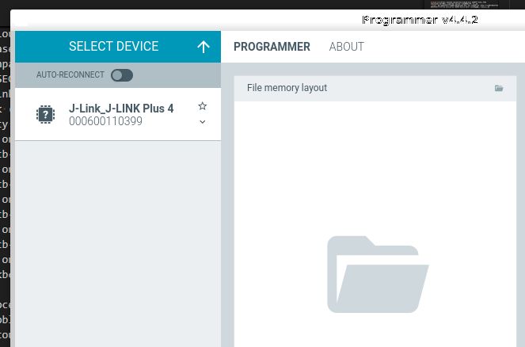
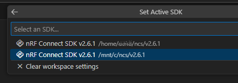

# wsl2: USBを使ってみよう

_2024/11/26_

最近の組み込みソフトウェア開発では USB を使うことが多い。  
昔は専用ボードだったり RS-232C だったり パラレルのプリンタケーブルで ROM ライターを接続したりだったが、
USB が PC で普通に使われるようになってからは DOS/V 系だけでなく Mac でも開発ができるようになっていったように思う。

WSL2 でも USB が使えるなら、ncs のようにテスト環境は Linux じゃないと動かないような環境でも安心だ。  
今回は J-Link にアクセスできるようになりたい。

* [USB デバイスを接続する - Microsoft Learn](https://learn.microsoft.com/ja-jp/windows/wsl/connect-usb)

[usbipd-win](https://github.com/dorssel/usbipd-win) というものを使う。  
chocolatey にもあったがバージョンがちょっと古いようだった。  
`winget` でもインストールできるし、GitHub から msi ファイルをダウンロードしてインストールしてもよさそうだ。  
インストールすると service に "USBIP Device Host" が自動で実行中になった。

TCP で 3240 番ポートを使うそうだ。  
Windows と WSL2 でやりとりするときにいるんだろう。

chocolatey にあった [sudo](https://github.com/janhebnes/chocolatey-packages/tree/master/Sudo) をインストールしているのだが、`usbipd` には使えなかった。  
また、管理者権限で開いていてもコマンドプロンプトではダメだった。
一瞬なにかウィンドウが開いているのが関係しているのか。

## 使い方

PowerShell を管理者権限で開いたところで動かしている。

まずは機器一覧を出す。

```powershell
> usbipd list
```

うちの環境ではこうなった。  
一番下の警告は wireshark で USB のログを取ることがあるので USBPcap をインストールしているためだろう。


WSL2 で使いたいデバイスを `usbipd bind` で共有状態にして `usbipd attach` で WSL2 側が使えるようになる。

```powershell
> usbipd bind --busid 4-1 --force
```

attach でエラーになった。  
ファイアウォールの設定をしていないせいかと思ったが、Windows 標準のファイアウォール設定には追加されていた。

```powershell
> usbipd attach --wsl --busid 4-1
usbipd: info: Using WSL distribution 'Ubuntu' to attach; the device will be available in all WSL 2 distributions.
usbipd: info: Using IP address 127.0.0.1 to reach the host.
WSL usbip: error: Attach Request for 4-1 failed - Device in error state
usbipd: error: Failed to attach device with busid '4-1'.
```

ただ、list で見ると共有状態になっていたので気にしなくてよいのか？

```powershell
> usbipd list
Connected:
BUSID  VID:PID    DEVICE                                                        STATE
1-14   26ce:01a2  USB 入力デバイス                                              Not shared
4-1    1366:0105  JLink CDC UART Port (COM15), J-Link driver                    Shared (forced)
5-1    0853:0200  USB 入力デバイス                                              Not shared
5-3    047d:2041  USB 入力デバイス                                              Not shared
5-4    04d6:e102  Webcam, USB 入力デバイス                                      Not shared
8-1    054c:06c3  NFC Port/PaSoRi 100 USB                                       Not shared
8-4    17e9:01bb  LCD-8000U                                                     Not shared

Persisted:
GUID                                  DEVICE

usbipd: warning: USB filter 'USBPcap' is known to be incompatible with this software; 'bind --force' will be required.
```

しかし WSL2 側で `lsusb` しても root hub しか出てこない。。。

あ、VMware が J-Link を検出していた。  
`usbipd unbind` で一度共有を解除してやりなおし。。。もダメだった。  
`--force` が使えるのは `bind` のときだけっぽい。

USBPcap をアンインストールしたところ成功した。  
まあ、ほとんど使っていなかったので問題ない。  
[キャプチャ](https://github.com/dorssel/usbipd-win/wiki/Troubleshooting#usb-capture)ができるので、もしかしたら USBPcap の代わりをしてくれるかもしれない。

Wiki とか [GUIツール](https://gitlab.com/alelec/wsl-usb-gui) を見ていると、ST-Link だったり J-Link だったりとみんな同じ感じなんだとちょっと安心する。

### WSL2

では引き続き WSL2 側を見ていく。  
`lsusb` で確認できた。

```console
$ lsusb
Bus 002 Device 001: ID 1d6b:0003 Linux Foundation 3.0 root hub
Bus 001 Device 002: ID 1366:0105 SEGGER J-Link_J-LINK Plus 4
Bus 001 Device 001: ID 1d6b:0002 Linux Foundation 2.0 root hub
```

あとは普通にやれば良いそうだ。

手っ取り早く nRF Connect for Desktop の Programmer を立ち上げてみよう。

* [nRF Connect for Desktop - Downloads - nordicsemi.com](https://www.nordicsemi.com/Products/Development-tools/nrf-connect-for-desktop/download)

と、その前に J-Link のインストールがいる。  
Windows にあわせて V7.94i にする。  
`wget` でやろうとしたけど accept とかの操作があるのでダメだった。

* [SEGGER - The Embedded Experts - Downloads - J-Link / J-Trace](https://www.segger.com/downloads/jlink/)

そしてインストールしてみたがエラーが！

```console
$ sudo dpkg -i JLink_Linux_V794i_x86_64.deb
Selecting previously unselected package jlink.
(Reading database ... 73738 files and directories currently installed.)
Preparing to unpack JLink_Linux_V794i_x86_64.deb ...
Removing /opt/SEGGER/JLink ...
/opt/SEGGER/JLink not found (OK)
Unpacking jlink (7.949) ...
dpkg: dependency problems prevent configuration of jlink:
 jlink depends on libxcb-render-util0 (>= 0.3.8); however:
  Package libxcb-render-util0 is not installed.
 jlink depends on libxcb-icccm4 (>= 0.3.9); however:
  Package libxcb-icccm4 is not installed.
 jlink depends on libxcb-keysyms1 (>= 0.3.9); however:
  Package libxcb-keysyms1 is not installed.
 jlink depends on libxcb-image0 (>= 0.3.9); however:
  Package libxcb-image0 is not installed.
 jlink depends on libxkbcommon-x11-0 (>= 0.5.0); however:
  Package libxkbcommon-x11-0 is not installed.

dpkg: error processing package jlink (--install):
 dependency problems - leaving unconfigured
Errors were encountered while processing:
 jlink
```

どうも、DEB のインストールも最近は `apt install` でやるようだ。  
足りていないパッケージも `--fix-broken` でうまいことやってくれるみたい。よかった。

```console
$ sudo apt --fix-broken install ./JLink_Linux_V794i_x86_64.deb
```

インストールし終わって Programmer を起動すると、ちゃんと J-Link が見えた。



nRF Connect SDK for VS Code でもちゃんと見えた。  
Flash も成功している。

`usbipd` での共有(bind)状態は WSL2 の再起動でも維持される。  
ただ attach はされていないので実行する必要がある。  
~"busid" も変化がなかったので、PowerShell の履歴で実行できるのは助かる。~
"busid" は変化した。デスクトップPC で USBハブなことが影響している？

```powershell
> usbipd list
Connected:
BUSID  VID:PID    DEVICE                                                        STATE
1-14   26ce:01a2  USB 入力デバイス                                              Not shared
5-1    054c:06c3  NFC Port/PaSoRi 100 USB                                       Not shared
5-4    17e9:01bb  LCD-8000U                                                     Not shared
6-1    1366:0105  JLink CDC UART Port (COM15), J-Link driver                    Shared
7-1    0853:0200  USB 入力デバイス                                              Not shared
7-3    047d:2041  USB 入力デバイス                                              Not shared
7-4    04d6:e102  Webcam, USB 入力デバイス                                      Not shared

Persisted:
GUID                                  DEVICE
```

### 遅いのは ncs の参照パスのせい

それとは別の話になるが、WSL2 でビルドするとえらく時間がかかっている。  
最初からビルドするときは一休みできるくらいかかる。  
無視できないくらいに時間がかかるのだ。

Unity Test のときはプロジェクトを WSL のファイルシステムに置くだけで改善したが、今回は最初からそうしている。  
といっても、別ドライブの仮想ディスクだが。

Windows でビルドしたときのログと見比べているが、パスが違うのと WSL2 では `ccache` を使っている記述があるくらいだ。  
CPU 負荷が高いわけでもないし、なんだろう。

VMware インストール時に有効にした「Windowsハイパーバーザープラットフォーム」はどうだろうか。  
・・・変化なかった。

あれこれやってたどり着いたのは、vscode のワークスペース設定 `.vscode/settings.json` で以下のようにしていたのだが `nrf-connect.sdk` が WSL2 の方ではなく Windows の `/mnt/c` にある ncs v2.6.1 を使うようになっていたのだ。

```json
{
    "nrf-connect.toolchain.path": "${nrf-connect.toolchain:2.6.1}",
    "nrf-connect.topdir": "${nrf-connect.sdk:2.6.1}"
}
```



`/home` にもインストールしているので変更することはできる。  
そうすると普通の速度でビルドが終わった。  
コマンドラインでビルドしたら何か分かるかもしれないと `west` を実行しようとして `nrfutil toolchain-manager launch --shell` をしてみたが `west build` ができず、そういえばパスってどうなってんだっけと確認して発覚した次第である。

指定すれば良いだけではあるのだが、じゃあ `nrf-connect.sdk` みたいなのはどこからパスを引っ張ってくるんだ、
"default locations" は `<home>/ncs` と[書いている](https://docs.nordicsemi.com/bundle/ncs-latest/page/nrf/installation/install_ncs.html#install_the_nrf_connect_sdk_toolchain)んだけどねぇ。

SDK の選択によって `.vscode/settings.json` はこうなっていた。

* `/mnt/c`にある方を選択: `"nrf-connect.topdir": "${nrf-connect.sdk:2.6.1}"`
* `/home`にある方を選択: `"nrf-connect.topdir": "/home/<ユーザ>/ncs/v2.6.1"`

User Settings で `nrf-connect.sdk` にパスを設定したらできるのでは！と思ったが、そういう設定はなかった。
`nrf-connect.topdir` はあるのだが、これは未指定の場合だからなぁ。

ここまでできたら Windows 側に固執する必要もないので、全部 WSL2 に持っていって Windows 側の ncs を削除してしまえば良かろう。
