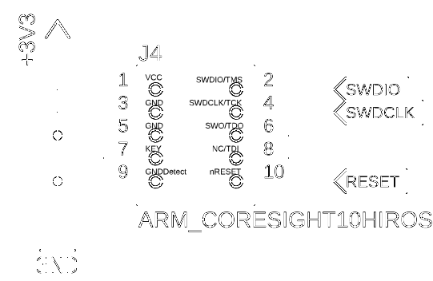

# ncs: USBでのDFU (4)

_2024/12/05_

引き続き DFU についての調査を行う。  
MCUboot で DFUモード(Bootloader モードや Serial Recovery モードなどいろいろ呼び名がありそうだがこのページではこの用語にしておく)になることはできたが、DFU 自体に成功していない件の調査を進めている。

* [ncs: USBでのDFU (1) - hiro99ma blog](https://blog.hirokuma.work/2024/12/20241202-ncs.html)
* [ncs: USBでのDFU (2) - hiro99ma blog](https://blog.hirokuma.work/2024/12/20241203-ncs.html)
* [ncs: USBでのDFU (3) - hiro99ma blog](https://blog.hirokuma.work/2024/12/20241204-ncs.html)

今頃気付いたけど、DFU over UART からやり始めているからタイトルとちょっと合わないな。  
まあ、終わったら USB CDC-ACM 経由でやるから見逃しておくれ。

## DevAcademy

USB CDC-ACM での DFU は Exercise 2 で行われていてそちらだけ試していたのだが、うまくいかないので Exercise 1 をちゃんとやることにした。

* [Exercise 1 - DFU over UART - Nordic Developer Academy](https://academy.nordicsemi.com/courses/nrf-connect-sdk-intermediate/lessons/lesson-8-bootloaders-and-dfu-fota/topic/exercise-1-dfu-over-uart/)

ひとことで DFU over UART といっても 2つあり、両方とも有効にすることもできる。  
ステップを実行すると両方とも有効にしたアプリになる。

* MCUboot での DFU(Serial Recovery): Step 1 - 4
* アプリでの DFU: Step 5

`uart0` は PC と接続すると VCOM ポートとして見えるそうだ。  
これは DKシリーズの OnBoard タイプ J-Link だからだろうか？  
私は外付けの J-Link Plus を所有しているのだが、これはこれで USB シリアルのポートとして見えている。


J-Link の UART は使ったことが無い。

* [J-Linkで仮想シリアルポートを使う](http://idken.net/posts/2018-02-01-jlink_serial/)
  * Configurator で有効にするよう書かれていたが、今の J-Link では有効になっていた(上画像でポートが見えているやつ)
* [J-Link Virtual COM Port - SEGGER Wiki](https://wiki.segger.com/J-Link_Virtual_COM_Port)

nRF から使えるのかと思ったが、1.27mm のコネクタだとそういうピンがなかった。  
残念だが普通に nRF の UART を使う。

* [9-pin JTAG/SWD connector - SEGGER Wiki](https://wiki.segger.com/9-pin_JTAG/SWD_connector)
  * [20-pin J-Link Connector - SEGGER Wiki](https://wiki.segger.com/20-pin_J-Link_Connector) には "J-Link Tx" と "J-Link Rx" がある



### mcumgr-cli

DFU over UART のために [mcumgr-cli](https://developer.nordicsemi.com/nRF_Connect_SDK/doc/latest/zephyr/services/device_mgmt/mcumgr.html#command-line-tool) というコマンドラインツールをダウンロードする。  
`go install` で行うので `$GOPATH/bin` にダウンロードされる。`$GOPATH` が未設定なら `$HOME/go` になるので `$HOME/go/bin/` にダウンロードされるだろう。  
最近の golang は、ソースコードについては `GOPATH` に依存しなくても良いようになってきたが `bin/` や `pkg/` には使われている。  
`npm` や `venv` みたいに各アプリごとに `GOPATH` を分けて運用した方がよいかと思って分けていたが、まあ場合によりけりですな。  
`go install` すると上書きになるので、特定のバージョンの実行ファイルが使いたい場合に困ったりするので。

そういう事情はさておき `mcumgr-cli` をインストールして使えるようにしておく。  
`go install` するリポジトリが "apache/mynewt-mcumgr-cli" になっていて、これは Nordic のアプリではない。  
[Apache Mynewt](https://mynewt.apache.org/) という組み込み OS のプロジェクトだそうだ。

本家はいろいろ書いてあるので概要の把握なら [wikipedia](https://ja.wikipedia.org/wiki/Apache_Mynewt) の方が向いているか。  
使う [mcumgr-cli](https://github.com/apache/mynewt-mcumgr-cli) 自体はリモートデバイスで動いている mcumgr server と通信するクライアントアプリらしい。  
Nordic のページには [SMP Protocol](https://docs.nordicsemi.com/bundle/ncs-latest/page/zephyr/services/device_mgmt/smp_protocol.html) がどうのこうの書いてあるし、サーバ側には [Zepher での設定](https://github.com/apache/mynewt-mcumgr/blob/master/README-zephyr.md) もあり、[MCUbootのZephyrページ](https://docs.mcuboot.com/readme-zephyr.html) にも MCUmgr という言葉が出てくるので、nRF 側でサーバが動くのだろう。

MCUboot で MCUmgr が出てくるところに `CONFIG_BOOT_SERIAL_WAIT_FOR_DFU=y` にするとこのモード(MCUmgrのコマンドを受け取るモード？)が使えると書いてある。  
DevAcademy の Lesson では出てこなかったが、いらないのだろうか？  
Nordic AI に聞くと、ハードウェアボタン無しで DFUモードに入る場合に特に有効とのことだ。  
DFU モードに入るときだけならボタンがあればいらないのか。

[MCUboot のページ](https://docs.mcuboot.com/readme-zephyr.html) に書いてあって関係しそうな設定はこの辺か。  
後半は関係なさそう。

* Interface selection
  * `CONFIG_MCUBOOT_SERIAL`
  * `BOOT_SERIAL_DEVICE`
  * `CONFIG_BOOT_SERIAL_UART` or `CONFIG_BOOT_SERIAL_CDC_ACM`
  * devicetree
    * `zephyr,console` : hardware serial port
    * `zephyr,cdc-acm-uart` : virtual serial port
* Entering the serial recovery mode
  * `CONFIG_BOOT_SERIAL_WAIT_FOR_DFU` and `CONFIG_BOOT_SERIAL_WAIT_FOR_DFU_TIMEOUT`
    * `mcumgr-cli` で DFUモードになりたい場合
  * devicetree
    * `mcuboot_button0`
* Direct image upload
  * デフォルトでは first slot だけ使う
    * swap-move などはしないという意味か
  * `CONFIG_MCUBOOT_SERIAL_DIRECT_IMAGE_UPLOAD` and `CONFIG_UPDATEABLE_IMAGE_NUMBER`
    * swap-move するためにアップロード先を変更したい場合か？
* System-specific commands
  * `CONFIG_ENABLE_MGMT_PERUSER`
  * `CONFIG_BOOT_MGMT_CUSTOM_STORAGE_ERASE`
  * `CONFIG_BOOT_MGMT_CUSTOM_IMG_LIST`

あとは Exercise 1 をやりながら見ていこう。

### DFU over UART to MCUboot

DK のデバッガは Mass Storage が有効になっているそうだ。Mbed みたいなやつかな？  
邪魔になるかもしれないので `JLinkExe` などで無効化するそうだ。  
[使っている開発ボード](https://www.switch-science.com/products/8658?_pos=3&_sid=0c8c07a88&_ss=r) は DK ではないし Mass Storage にもなっていないが、一応やっておこう。  
`MSDDisable` は "Mass Storage Device Disable" の略か。

```console
$ JLinkExe -device NRF5340_XXAA -if SWD -speed 4000 -autoconnect 1 -SelectEmuBySN <シリアル番号>
SEGGER J-Link Commander V7.94i (Compiled Feb  7 2024 17:10:11)
DLL version V7.94i, compiled Feb  7 2024 17:09:47

Connecting to J-Link via USB...O.K.
...
Connecting to target via SWD
...
Memory zones:
  Zone: "Default" Description: Default access mode
Cortex-M33 identified.

J-Link>MSDDisable
Probe configured successfully.
J-Link>exit
$
```

Step 3 までやったが、やはりつながらない。。。

```console
$ mcumgr conn add ssci type="serial" connstring="dev=/dev/ttyUSB0,baud=115200,mtu=512"
Connection profile ssci successfully added
$ mcumgr -c ssci image list
Error: NMP timeout
```

他に何かなかったか考えていて、そういえば先月に UART 周りについて何かしていたことを思い出した。

* [ncs: UART RXにHI入力があると電源がONになる (2) - hiro99ma blog](https://blog.hirokuma.work/2024/11/20241108-ncs.html)

そうだ、nRF の UART RX に HI 入力があると勝手に電源が入ってしまって困るので、ログ出力専用なら取り外してしまえ、と配線ごと抜いたんだった・・・。  
つなぎ直してコマンドを実行するとあっさり動いた。  
なんということか。。。

```console
$ mcumgr -c ssci image list
Images:
 image=0 slot=0
    version: 0.0.0
    bootable: false
    flags:
    hash: Unavailable
Split status: N/A (0)
```

では DFU しようとしたのだが `app_update.bin` というファイルがない。  
署名チェックをするようだから `zephyr.signed.bin` だろうか？

```console
$ find ./build -name "*.bin"
./build/l8_e1/zephyr/zephyr.bin
./build/l8_e1/zephyr/zephyr.signed.bin
./build/mcuboot/zephyr/zephyr.bin
```

LED の点滅速度を変更してビルドだけ実施し `zephyr.signed.bin` をアップロード！

```console
$ mcumgr -c ssci image upload build/l8_e1/zephyr/zephyr.signed.bin
 22.99 KiB / 22.99 KiB [=================================] 100.00% 2.98 KiB/s 7s
Done
```

アップロード成功。  
自動で再起動はされなかったが、手動で再起動させると LED 点滅周期が変わっている。  
成功だ！

## おわりに

結局のところ、DFU over UART がうまくいってなかったのは配線の問題だけだった。  
しかし USB 経由の場合は配線とは関係が無いので、やはりまだ問題が残っているのか。

CDC-ACM でのアップロードは次回にする。

## おまけ

DevAcademy Intermediate のリポジトリを見たら 20時間前に Lesson 8 が削除されてるーーー。

* [commit: ncs-inter](https://github.com/NordicDeveloperAcademy/ncs-inter/commit/0d1e3dd5ce85b6ebcfc633527acd3ce73dc85d9e)

他にもいろいろ削除されているが、これはきっと更新中だからに違いない。。。  
私は信じてるぞ！
