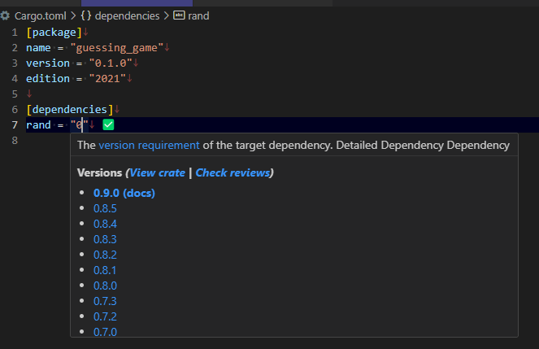

# rust: Rustがんばろう 1日目

## はじめに

あきらめて Rust を勉強することにした。  
がんばろう。

## 本

昔買った本があった。  
ネットにあるのを本に落とし込んだような内容だった気がする。

* [「プログラミング言語Rust 公式ガイド」SteveKlabnik \[ＰＣ・理工科学書\] - KADOKAWA](https://www.kadokawa.co.jp/product/301905000150/)

どちらが先なのかは知らないが、今はネットにも日本語版があるのでそちらの方を読んだ方がよいと思う。そちらの方が新しいし。  
当時はもう1冊有名な本があって、それを知人が持っていたからこっちを買ったというだけだった気がする。

* [The Rust Programming Language 日本語版 - The Rust Programming Language 日本語版](https://doc.rust-jp.rs/book-ja/)

ともあれ、高い金を出して買ったのだから元は取りたいので読もう。

自分のやる気を出すためにブログには書いていくが、たぶんメモ程度だろう。

## インストール

`~/.profile` と `~/.bashrc` の最後に `~/.cargo/env` を読む処理が追加されていた。  
処理というか `source` だが。  
`export PATH="$HOME/.cargo/bin:$PATH"` しているのだけど、既に `PATH` に入っていたら実行しないようになってるのね。

```bash
#!/bin/sh
# rustup shell setup
# affix colons on either side of $PATH to simplify matching
case ":${PATH}:" in
    *:"$HOME/.cargo/bin":*)
        ;;
    *)
        # Prepending path in case a system-installed rustc needs to be overridden
        export PATH="$HOME/.cargo/bin:$PATH"
        ;;
esac
```

インストールされたのはこのバージョンだった。

```console
$ rustc --version
rustc 1.84.1 (e71f9a9a9 2025-01-27)
$ cargo --version
cargo 1.84.1 (66221abde 2024-11-19)
```

* [Rust in Visual Studio Code](https://code.visualstudio.com/docs/languages/rust)

## printのみ

ありがちな、`main()` で `print()` だけ呼ぶファイルをコンパイルした。
なんとなく `nm` でオブジェクトを見ておく。

* [object](https://doc.rust-lang.org/rustc/command-line-arguments.html)

```console
$ rustc --emit=obj main.rs 
$ nm main.o
0000000000000000 r .L__unnamed_2
0000000000000000 V DW.ref.rust_eh_personality
0000000000000000 r GCC_except_table6
                 U _Unwind_Resume
                 U _ZN3std2io5stdio6_print17h9d0e58a07bb0d1f1E
0000000000000000 T _ZN3std2rt10lang_start17hcbf6f8d37069d203E
0000000000000000 t _ZN3std2rt10lang_start28_$u7b$$u7b$closure$u7d$$u7d$17h44762d4ab76b21baE
                 U _ZN3std2rt19lang_start_internal17h712a1d4742291d0cE
0000000000000000 t _ZN3std3sys9backtrace28__rust_begin_short_backtrace17h642caff2723593a1E
0000000000000000 t _ZN4core3fmt9Arguments9new_const17h25a058ff87034f41E
0000000000000000 t _ZN4core3ops8function6FnOnce40call_once$u7b$$u7b$vtable.shim$u7d$$u7d$17h35597321a4c58531E
0000000000000000 t _ZN4core3ops8function6FnOnce9call_once17h8bcefcb32f5a62e4E
0000000000000000 t _ZN4core3ops8function6FnOnce9call_once17hacf4f481a8a5186dE
0000000000000000 t _ZN4core3ptr85drop_in_place$LT$std..rt..lang_start$LT$$LP$$RP$$GT$..$u7b$$u7b$closure$u7d$$u7d$$GT$17h5e867b62eed0d085E
0000000000000000 t _ZN4main4main17hbd8ece3b05d9f3a5E
0000000000000000 t _ZN54_$LT$$LP$$RP$$u20$as$u20$std..process..Termination$GT$6report17h927feb599ba86b3dE
0000000000000000 T main
                 U rust_eh_personality


$ nm -C main.o
0000000000000000 r .L__unnamed_2
0000000000000000 V DW.ref.rust_eh_personality
0000000000000000 r GCC_except_table6
                 U _Unwind_Resume
                 U std::io::stdio::_print
0000000000000000 T std::rt::lang_start
0000000000000000 t std::rt::lang_start::{{closure}}
                 U std::rt::lang_start_internal
0000000000000000 t std::sys::backtrace::__rust_begin_short_backtrace
0000000000000000 t core::fmt::Arguments::new_const
0000000000000000 t core::ops::function::FnOnce::call_once{{vtable.shim}}
0000000000000000 t core::ops::function::FnOnce::call_once
0000000000000000 t core::ops::function::FnOnce::call_once
0000000000000000 t core::ptr::drop_in_place<std::rt::lang_start<()>::{{closure}}>
0000000000000000 t main::main
0000000000000000 t <() as std::process::Termination>::report
0000000000000000 T main
                 U rust_eh_personality
```

このくらいでは最適化するところはほとんど無い。  
何をリンクしたら実行ファイルにできるのかは分からんかった。

```console
$ rustc main.rs
$ ls -l main
-rwxr-xr-x 1 xxxx xxxx 3937592 Feb  7 14:46 main
$ rustc -C opt-level=3 main.rs
$ ls -l main
-rwxr-xr-x 1 xxxx xxxx 3937128 Feb  7 14:46 main

$ rustc --emit=obj -C opt-level=3 main.rs
$ nm --demangle main.o
                 U std::io::stdio::_print
0000000000000000 T std::rt::lang_start
0000000000000000 t std::rt::lang_start::{{closure}}
                 U std::rt::lang_start_internal
0000000000000000 t std::sys::backtrace::__rust_begin_short_backtrace
0000000000000000 t core::ops::function::FnOnce::call_once{{vtable.shim}}
0000000000000000 t main::main
0000000000000000 T main
```

既にあるディレクトリに対しては `cargo init`。  
本には `--bin` が書いてあったがデフォルトのようだった。
以前はそうではなかったのだろうか？

```console
$ cargo init .
    Creating binary (application) package
note: see more `Cargo.toml` keys and their definitions at https://doc.rust-lang.org/cargo/reference/manifest.html
$ ls -a
.  ..  .git  .gitignore  Cargo.toml  main.o  main.rs
```

`build` だと実行ファイルはちょっと増えたが `build --release` だと 1桁減った。  
最適化とはまた違うようだ。リンクするライブラリが違うのかな？

```console
$ cargo build
   Compiling hello v0.1.0 (/home/xxxx/rust/hello)
    Finished `dev` profile [unoptimized + debuginfo] target(s) in 0.36s$ ls -l ./target/debug/hello
-rwxr-xr-x 2 xxxx xxxx 3945896 Feb  7 15:25 ./target/debug/hello

$ cargo build --release
   Compiling hello v0.1.0 (/home/xxxx/rust/hello)
    Finished `release` profile [optimized] target(s) in 0.23s
$ ls -l ./target/release/hello
-rwxr-xr-x 2 xxxx xxxx 429760 Feb  7 15:30 ./target/release/hello
```

## dependi

乱数を発生させるライブラリ？クレート？を追加するのに `Cargo.toml` に追加がいる。  
クレート名の入力だけならまだしもバージョンはちょっと勘弁して！

探すと、今は Dependi という vscode extension を使うのがよいそうだ。

* [Dependi - Visual Studio Marketplace](https://marketplace.visualstudio.com/items?itemName=fill-labs.dependi)

crate の名前を書いて、バージョンは空文字列だとエラーになるので適当に数字を入れる。  
と、新しい順にバージョンっぽい数字が出てきた。  
クリックしても打ち込まれはしないようなので手入力した。
まあ、自分で調べずに済むだけでもありがたい。



### rand 0.9.0

最新だからいいだろうと選んだ v0.9.0 だが、いろいろ変わっていた。

* [Rng in rand v0.9.0 - Rust](https://docs.rs/rand/0.9.0/rand/trait.Rng.html)

"Deprecated since 0.9.0" にいくつかなっていて、その 1つがここで使われている `gen_range` だった。

* gen
* gen_range
* gen_bool
* gen_ratio

今では [random_range](https://docs.rs/rand/0.9.0/rand/trait.Rng.html#method.random_range) という名前になったそうだ。  
範囲の書き方は `[start, end)` のようだ。整数型でよいのかな？

* [Range in std::ops - Rust](https://doc.rust-lang.org/std/ops/struct.Range.html)

```rust
    let secret_number = rand::rng().random_range(1..101);
    println!("secret_number = {}", secret_number);
```

`rand::rng()` だけで変数にするときは `mut` がいるようだ。

## おわりに

まだまだ最初の方しか読んでいない。
先は長いな。
