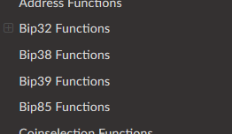

# btc: BIP-32,38,39,85の概要

_2025/02/12_

## はじめに

libwally-core の API を見ていると、BIP の名が付いたカテゴリーがあった。

* [libwally-core documentation — libwally-core 1.3.1 documentation](https://wally.readthedocs.io/en/release_1.3.1/index.html)

BIP-32 は HDウォレットだったと思うが、厳密にどの BIP がどの内容かは把握していなかった。  
概要は ChatGPT 氏にまとめてもらった内容から構成しただけなので、自分で調べるのが良い。

## BIP

Bitcoin に関する提言や決まり事がまとめてあるのが BIP だ。

* [bitcoin/bips: Bitcoin Improvement Proposals](https://github.com/bitcoin/bips)

なお、すべての BIP が有効なわけではない。  
提案されただけだったり取り下げられたりすることもあるので status を確認してから読もう。

### BIP-32

いわゆる「HDウォレット」である。

* [BIP-32: Hierarchical Deterministic Wallets](https://github.com/bitcoin/bips/blob/master/bip-0032.mediawiki)
* [Bip32 Functions — libwally-core 1.3.1 documentation](https://wally.readthedocs.io/en/release_1.3.1/bip32.html)

1つの秘密鍵を使い回すと、もしどれか 1つでもトランザクションを攻撃されて秘密鍵が見つけられてしまうと、
関連した UTXO は自分の持ち物ではなくなったのと同じである。  
毎回秘密鍵は変えるのがよいけど、毎回乱数を作ると送金のたびにバックアップを取らないといけない。

BIP-32 は一意の seed からインクリメントするインデックス値で新しい秘密鍵を作るしくみである。  
単にインデックス値を使うだけでなく、アカウントのような階層を用意することで 1つの seed から違う系統の秘密鍵を作ることもできるようになっている。

### BIP-38

パスフレーズによる秘密鍵の暗号化についてである。

* [BIP-38: Passphrase-protected private key](https://github.com/bitcoin/bips/blob/master/bip-0038.mediawiki)
* [Bip38 Functions — libwally-core 1.3.1 documentation](https://wally.readthedocs.io/en/release_1.3.1/bip38.html)

「パスフレーズ」という言葉はウォレットアプリで 12単語や 24単語を入力する際によく使われるのだが、
BIP 的にはあれは「ニモニック(mnemonic)」であり、この次の BIP-39 で出てくる。

API も `bip38_from_private_key()` や `bip38_to_private_key()` のようになっている。  
BIP-38 フォーマットで秘密鍵を保存しておくと、そのフォーマットからさらにデコードしないと秘密鍵にならないということである。

### BIP-39

ニモニックについてである。

* [BIP-39: Mnemonic code for generating deterministic keys](https://github.com/bitcoin/bips/blob/master/bip-0039.mediawiki)
* [Bip39 Functions — libwally-core 1.3.1 documentation](https://wally.readthedocs.io/en/release_1.3.1/bip39.html)

ウォレットを作るときに出てくるあれだ。  
英単語なことが多いが[他の言語](https://github.com/bitcoin/bips/tree/master/bip-0039)もある。

seed とニモニックは相互に変換できるのかと思っていたけど[ニモニックからseed](https://github.com/bitcoin/bips/blob/master/bip-0039.mediawiki#from-mnemonic-to-seed)の方向だけである。  
昔 API を作るときにいろいろ探したけど見つからなかったので、たぶんそうなのだろう。

### BIP-85

BIP-32 の HD ウォレットを Bitcoin ではないチェーンなどでも使えるようにするしくみ。

* [Deterministic Entropy From BIP32 Keychains](https://github.com/bitcoin/bips/blob/master/bip-0085.mediawiki)
* [Bip85 Functions — libwally-core 1.3.1 documentation](https://wally.readthedocs.io/en/release_1.3.1/bip85.html)

ハードウェアウォレットでいろいろ対応しているものがあるが、それがこれなのかな？  
libwally-core にあるのは Elements/Liquid のためだろうか。

## おわりに

たまにはライブラリ任せにせず BIP を読まないといかんな。
