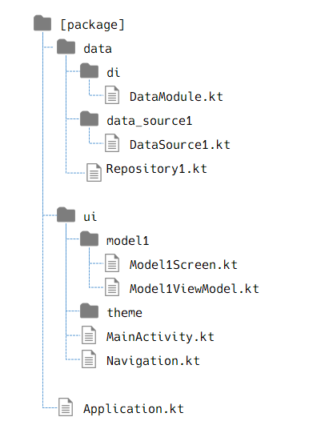

# Android開発

Android Studio を使った Jetpack Compose でのアプリを作ろうとしたときの調査メモを残すページ。

## はじめに

基本的に、モバイルアプリ開発は簡単ではない。  
対象は Android か iOS になるだろうが、それぞれ開発環境が違う。  
Android は Android Studio で Kotlin を使うし、iOS は Xcode で Swift を使うのがネイティブな開発になる。

仕事でモバイルアプリを作るとき、だいたい両方に向けて作らないといけないだろう。  
となると両方の環境を使いこなさないといけないかというと、そうでもない。  
Flutter や React Native のような開発環境を使うと両方に向けたアプリを作りやすいかもしれない。

ただ、それでもどうしてもネイティブな開発をしないといけないことがある。  
ライブラリでしか機能がなく、かつプラグインのようなものが提供されていない場合はそうだろう。
そういうときは多少はネイティブな部分を触ることになるだろう([Flutter](https://docs.flutter.dev/platform-integration/platform-channels), [React Native](https://reactnative.dev/docs/native-platform))。

それ以外だと、ネイティブな環境だけの方がやりやすい場合だと思う。  
例えば、Android のライブラリを作りたい(アプリは特に用意してない)という場合など。  
そのために Flutter などのアプリをわざわざ作り、ライブラリとアプリをつなぐコードを書きたくないと思うかもしれない。  
ライブラリを呼ぶだけの簡単なアプリを作った方がわかりやすいのではなかろうか(個人の感想です)。  
あと、ネイティブアプリの方がやはり動きがよさそうな気がする。

そういうわけでネイティブアプリを作るシーンはまだあると思うのだった。

## よく使うページ

* Android Developers
  * [Jetpack Compose を使ってみる](https://developer.android.com/develop/ui/compose/documentation?hl=ja)
    * いろいろリンクがあるので見てみるとよさそう
  * [Codelabs](https://developer.android.com/courses/android-basics-compose/course?hl=ja)
    * 一通りやるとよい

## アプリの構成

[アプリアーキテクチャ](https://developer.android.com/topic/architecture?hl=ja)の通りにするのが無難。  
`ViewModel`でなくてもよいが使う方が無難。

* UI Layer
  * UI elements: 画面の描画だけ
    * `@Composable`関数で画面を作る
  * State holders: UI elements で表示するデータの元ネタ
    * `ViewModel`を使う
* Domain Layer(optional)
* Data Layer
  * Repository: State holders が扱うデータ
  * Data sources: データの供給元
    * データベースやインターネットなど

簡単なアプリで済ませたいなら UI elements に全部書くこともできるし、`ViewModel`まで使うようなこともできる。  
あるいは全然違う構造でも問題はない。

### 画面遷移

* [Compose で画面間を移動する](https://developer.android.com/codelabs/basic-android-kotlin-compose-navigation?hl=ja#0)
  * アプリ内の遷移
  * 別アプリへの遷移(`Intent`)
