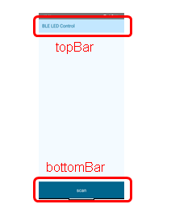

# UI Layer(Jetpack Compose)

_2024/10/31_

Android Studio の新規プロジェクト作成で作るか、[archtecture-templates/base](https://github.com/android/architecture-templates/tree/base) を元にするのがよい。  
View ベースアプリの場合は GUI で XML ファイルを更新することができたが Composable 関数の場合にはそれが無い。

## Composable関数

### レイアウト

[Column](https://developer.android.com/reference/kotlin/androidx/compose/foundation/layout/package-summary#Column(androidx.compose.ui.Modifier,androidx.compose.foundation.layout.Arrangement.Vertical,androidx.compose.ui.Alignment.Horizontal,kotlin.Function1))などを組み合わせる。  
これらも Composable 関数なので`Text`などの部品と組み合わせることができる。

* [androidx.compose.foundation.layout](https://developer.android.com/reference/kotlin/androidx/compose/foundation/layout/package-summary)
  * よく使う関数: `Box`, `Column`, `Row`, `Spacer`

レイアウトは難しい。  
あまりにうまく行かない場合は、画像でレイアウトを作って Gemini などにサンプルコードを書いてもらうと良いだろう。

* [Compose でのレイアウト  -  Jetpack Compose  -  Android Developers](https://developer.android.com/develop/ui/compose/layouts?hl=ja)
* [Compose の基本レイアウト](https://developer.android.com/codelabs/jetpack-compose-layouts?hl=ja#6)

ちなみにブラウザで日本語表示にしているとメニューに「[ポケベル](https://developer.android.com/develop/ui/compose/layouts/pager?hl=ja)」という項目があるが、
これは "pager([無線呼び出し - wikipedia](https://ja.wikipedia.org/wiki/%E7%84%A1%E7%B7%9A%E5%91%BC%E3%81%B3%E5%87%BA%E3%81%97))" を直訳したものである。

### 部品

これを書いている時点ではマテリアルデザイン3(M3 と略されることもある)である。

* [https://m3.material.io/](https://m3.material.io/)
* [Compose のマテリアル コンポーネント](https://developer.android.com/develop/ui/compose/components?hl=ja)

`Text`のような基本部品はマテリアルデザインのバージョンごとに定義されているので注意しよう
(
[M2の`Text`](https://developer.android.com/reference/kotlin/androidx/compose/material/package-summary#Text(kotlin.String,androidx.compose.ui.Modifier,androidx.compose.ui.graphics.Color,androidx.compose.ui.unit.TextUnit,androidx.compose.ui.text.font.FontStyle,androidx.compose.ui.text.font.FontWeight,androidx.compose.ui.text.font.FontFamily,androidx.compose.ui.unit.TextUnit,androidx.compose.ui.text.style.TextDecoration,androidx.compose.ui.text.style.TextAlign,androidx.compose.ui.unit.TextUnit,androidx.compose.ui.text.style.TextOverflow,kotlin.Boolean,kotlin.Int,kotlin.Int,kotlin.Function1,androidx.compose.ui.text.TextStyle)), 
[M3の`Text`](https://developer.android.com/reference/kotlin/androidx/compose/material3/package-summary#Text(kotlin.String,androidx.compose.ui.Modifier,androidx.compose.ui.graphics.Color,androidx.compose.ui.unit.TextUnit,androidx.compose.ui.text.font.FontStyle,androidx.compose.ui.text.font.FontWeight,androidx.compose.ui.text.font.FontFamily,androidx.compose.ui.unit.TextUnit,androidx.compose.ui.text.style.TextDecoration,androidx.compose.ui.text.style.TextAlign,androidx.compose.ui.unit.TextUnit,androidx.compose.ui.text.style.TextOverflow,kotlin.Boolean,kotlin.Int,kotlin.Int,kotlin.Function1,androidx.compose.ui.text.TextStyle))
)。  
`androidx.compose.material3` は M3、数字が付かない `androidx.compose.material` は M2 である。

* [androidx.compose.material3](https://developer.android.com/reference/kotlin/androidx/compose/material3/package-summary)
  * よく使う関数:
    * `Button`, `Card`, `Text`
    * `MaterialTheme`, `Scaffold`, `Surface`
  * (ドキュメントのページが重たい)

`Image` は別のパッケージである。

* [androidx.compose.foundation](https://developer.android.com/reference/kotlin/androidx/compose/foundation/package-summary)
  * よく使う関数: `Image`

### Modifier

だいたいの Composable関数で引数に指定できる `Modifier`は調整に使う。  
同じ`Modifier`でも指定する関数によってパラメータにできないものもある。  
また、`Modifier`でも Composable関数でも同じような設定ができるものもある。  
一概にどちらがどうということは言えないので、必要になったときに調べると良いだろう。

* [androidx.compose.ui.Modifier](https://developer.android.com/reference/kotlin/androidx/compose/ui/Modifier)

### テーマ

新規プロジェクトで作成した場合、`ui/theme/Theme.kt`に`プロジェクト名Theme`という Composable関数 が作られている。  
デフォルトではダイナミックカラーが有効になっているので、実機で動作させるとエミュレータと色が異なるかもしれない。  
ダイナミックカラーを無効にしたり実機が未対応だったりすると[デフォルト(baseline)のテーマ](https://m3.material.io/styles/color/static/baseline)で表示される。  
アプリでのテーマを組み込むこともできる。  
自作するのは大変なのでいくつかテーマを作ってくれるサイトがある。  
アプリ名がないため`Theme.kt`のテーマ定義名が違っているくらいである。

* [Material Theme Builder](https://material-foundation.github.io/material-theme-builder/)

Codelabs では `Surface` を使う例が多い。

```kotlin
class MainActivity : ComponentActivity() {
    override fun onCreate(savedInstanceState: Bundle?) {
        enableEdgeToEdge()
        super.onCreate(savedInstanceState)
        setContent {
            AppTheme {
                Surface(modifier = Modifier.fillMaxSize()) {
                    MainScreen()
                }
            }
        }
    }
}
```

Android Studio でアプリを作ると [Scaffold](https://developer.android.com/develop/ui/compose/components/scaffold?hl=ja) が使われている。  
`topBar`と`bottomBar`を実装できるので、それだけで普通のアプリの見た目になる。

```kotlin
class MainActivity : ComponentActivity() {
    override fun onCreate(savedInstanceState: Bundle?) {
        super.onCreate(savedInstanceState)
        enableEdgeToEdge()
        setContent {
            AppTheme {
                Scaffold(modifier = Modifier.fillMaxSize()) { innerPadding ->
                    MainScreen(modifier = Modifier.padding(innerPadding))
                }
            }
        }
    }
}
```



### Preview

Composable関数は Android Studio でプレビュー画面を見ることができる。  
`@Preview` のパラメータで調整もできる。

* [コンポーザブルのプレビューで UI をプレビューする  -  Jetpack Compose  -  Android Developers](https://developer.android.com/develop/ui/compose/tooling/previews?hl=ja)

いくつかの Composable関数を組み合わせて 1つの画面にすることもあるので、
それぞれをプレビューで

### 画面遷移

画面の遷移もアプリ内とアプリ外があるが、ここではアプリ内について記載する。

* [ナビゲーションの原則  -  Android Developers](https://developer.android.com/guide/navigation/principles?hl=ja)
* [ナビゲーション  -  Android Developers](https://developer.android.com/guide/navigation?hl=ja)
* [Compose で画面間を移動する - Codelabs](https://developer.android.com/codelabs/basic-android-kotlin-compose-navigation?hl=ja#0)
  * アプリ内の遷移
  * 別アプリへの遷移(`Intent`)

#### 概要

ここでは画面遷移を固定で実装しておく方式について概要を記載する。  
Android Studio でプロジェクトを作った場合は画面遷移のコードはない。  
architecture-templates を使った場合は `NavHost()`は用意してあるが画面が 1枚しかないので遷移しない。  
[codelabs](https://developer.android.com/codelabs/basic-android-kotlin-compose-navigation?hl=ja#0)で一通りやって見るのがよいと思う。

* ライブラリを組み込む
* 画面遷移用の Composable関数を用意する
  * 画面名と対応する Composable関数を決めておく
  * `NavHost()`に、画面名と Composable関数の呼び出し方を定義する(`composable()`)
* Main Activity で呼び出すのは画面の Composable関数ではなく画面遷移の Composable関数に変更する
* 遷移は`rememberNavController()`のインスタンスを使う
  * `.navigate(画面名)`: 指定した画面に遷移
  * `.popBackStack()`: 戻る

画面遷移をするのに`rememberNavController()`のインスタンスがいるので、
それをどこで持ってどうするのがよいのかがまだよくわかっていない(2024/10/30現在)。  
[architecture-samples](https://github.com/android/architecture-samples/blob/130f5dbebd0c7b5ba195cc08f25802ed9f0237e5/app/src/main/java/com/example/android/architecture/blueprints/todoapp/TodoNavGraph.kt) では画面の Composable関数にボタン押下イベント関数として渡しているようだ。

### 依存するものは引数に取る

ボタン押下などのイベントが発生したときに実行する内容は直接実装せず、
自作 Composable関数の引数でもらうようにしておくと良い。  
そうするとテストするときにやりやすくなる。

また、状態についても UI elements では持たないようにする。  
そうすると UI elements としては[ステートレス](https://developer.android.com/develop/ui/compose/state?hl=ja#stateful-vs-stateless)にすることができる。

* [状態ホイスティング](https://developer.android.com/develop/ui/compose/state?hl=ja#state-hoisting)(hoist, hoisting)

## ViewModel

UI elements がステートレスになった分、ViewModel がステートフルになるという感じか。

概念的な ViewModel があるのかもしれないが、
少なくとも Android アプリでは [androidx.lifecycle.ViewModel](https://developer.android.com/reference/kotlin/androidx/lifecycle/ViewModel)クラスを継承する。

* [UI イベント  -  Android Developers](https://developer.android.com/topic/architecture/ui-layer/events?hl=ja)
* [状態ホルダーと UI 状態  -  Android Developers](https://developer.android.com/topic/architecture/ui-layer/stateholders?hl=ja)
* [Compose での ViewModel と状態](https://developer.android.com/codelabs/basic-android-kotlin-compose-viewmodel-and-state?hl=ja&continue=https%3A%2F%2Fdeveloper.android.com%2Fcourses%2Fpathways%2Fandroid-basics-compose-unit-4-pathway-1%3Fhl%3Dja%23codelab-https%3A%2F%2Fdeveloper.android.com%2Fcodelabs%2Fbasic-android-kotlin-compose-viewmodel-and-state#3)

[UI 状態生成パイプライン](https://developer.android.com/topic/architecture/ui-layer/stateholders?hl=ja#ui-state-production-pipeline)や[Android アーキテクチャに関する推奨事項](https://developer.android.com/topic/architecture/recommendations?hl=ja)を見るとビジネスロジックを UI Layer に置いてもよさそうではあるが、
[アプリの推奨アーキテクチャ](https://developer.android.com/topic/architecture?hl=ja#recommended-app-arch) でビジネスロジックは Data Layer 側であることを書いているのでその方がよいだろう。  

### UI state

UI elements で表示するのに使うデータは `data class` にまとめておき、ViewModel でインスタンスを生成して持っておく。  
データを提供する場合はインスタンスそのものではなく、その Read Only 版を提供するようにしておく。

具体的には Kotlin の `MutableStateFlow` でインスタンスを作り、`.asStateFlow()` で Read Only 版を提供する。  
Read Only 版はプロパティとして提供するのが普通なようだ。

* [UI 状態生成  -  Android Developers](https://developer.android.com/topic/architecture/ui-layer/state-production?hl=ja)

`State`系のインスタンスを UI elements が描画に使っていると、
インスタンスに更新が行われたときに自動で再composeが行われて描画に反映されるしくみになっている。

更新は`MutableStateFlow`のインスタンスを `.update{ it.copy(...) }` のように実行する。
