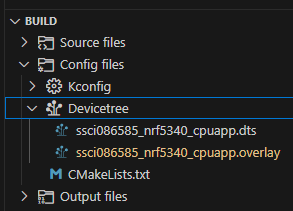

# DeviceTree

## DTSファイル

* [Devicetree - Nordic Developer Academy](https://academy.nordicsemi.com/courses/nrf-connect-sdk-fundamentals/lessons/lesson-2-reading-buttons-and-controlling-leds/topic/devicetree/)

### DTSファイルの構造(Version 1)

```dts
/dts-v1/;                       // DTS file version(たぶん省略可)
/ {                             // "root node"
  a-node {                      // "child node `a-node`"
    subnode_label: a-sub-node { // "label": child node `a-sub-node` is a child of `a-node`"
      foo = <3>;
    };
  };
};
```

### DTSファイルの読み込まれ方

拡張子は `.dts`。  
外部ファイルをインポートすることも可能で、インポートされる方は `.dtsi` とすることが多いが、
特にルールは無いため `.dts` が使われているところもある。  
インクルード以外に、DTS ファイルはビルド時に複数読み込まれ、
同じ設定がある場合は後から読み込んだファイルで上書きされる。  
Build Configuration でビルドするボードを選択するが、
ncs がインストールされたディレクトリ、あるいは `BOARD_ROOT`で指定されたディレクトリにあるファイルから選ぶ。  
その設定を読み込んだ後プロジェクトディレクトリにある `.overlay` ファイルが読み込まれる。  
どういう順番で読み込まれているかはビルド後の Build ペインを参照するのがよい(インクルードしたファイルは表示されない)。



## よくある DTSファイル構成

### $BOARD_ROOT/boards/arm/

`BOARD_ROOT`を指定していない場合は`<ncsディレクトリ>/zephyr\boards\arm/<ボード名>_<CPU名>/`

* `<ボード名>_<CPU名>_<種別>.dts`
  * 例: `thingy53_nrf5340_cpuapp.dts`
  * ボード名: thingy53
  * CPU名: nrf5340
  * 種別: cpuapp
* `<ボード名>_<CPU名>_<種別>.yaml`
  * `<compatible>`で使用する

* `<ボード名>_<CPU名>_common.dtsi`
  * 種別共通で使用する設定
* `<ボード名>_<CPU名>_common-pinctrl.dtsi`
  * 種別共通で使用する設定のうち`pinctrl`だけ

