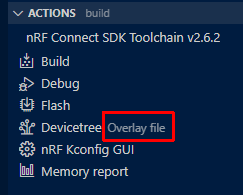
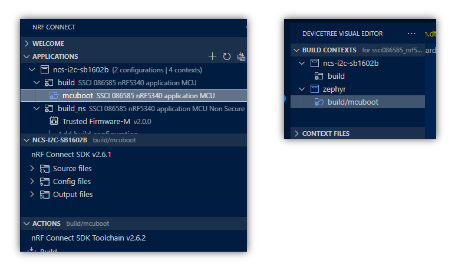

# Devicetree

_最終更新日: 2024/11/08_

ncs v2.6 (v2.7 はまだ見ていないが[DevAcademyの一部](https://academy.nordicsemi.com/courses/nrf-connect-sdk-fundamentals/lessons/lesson-2-reading-buttons-and-controlling-leds/topic/dissecting-blinky/)で v2.7以降があることから何かしら変更があることがうかがえる)。  
nRF Connect for VSCode は書いている時点での最新だが、しばしば更新されるのでこれを読んだ時点では画面や挙動が違うかもしれない。

## はじめに

* Nordic
  * [Devicetree - ncs v2.6.1](https://docs.nordicsemi.com/bundle/ncs-2.6.1/page/zephyr/build/dts/index.html)
  * [Devicetree - Nordic Developer Academy](https://academy.nordicsemi.com/courses/nrf-connect-sdk-fundamentals/lessons/lesson-2-reading-buttons-and-controlling-leds/topic/devicetree/)
* [devicetree.org v0.4](https://github.com/devicetree-org/devicetree-specification/releases/tag/v0.4)

Devicetree は ncs というよりも Zephyr に属している。  
Linux の kernel でも Devicetree 方式は使われているが、[devicetree.org](https://www.devicetree.org/)が本家のようで[Syntax and structure](https://docs.nordicsemi.com/bundle/ncs-2.6.1/page/zephyr/build/dts/intro-syntax-structure.html)でもそこのリンクが載っていた。

ncs で使うための知識だけにするので詳細は各ドキュメントをご参考に。  
まだ調査中なところが多いので、予測で書いているところは「と思う」などとしている。

## DTSファイルの構造(Version 1)

* [Syntax and structure - ncs v2.6.1](https://docs.nordicsemi.com/bundle/ncs-2.6.1/page/zephyr/build/dts/intro-syntax-structure.html)

```dts
/dts-v1/;                       // DTS file version(たぶん省略可)
/ {                             // root node
  a-node {                      // child node `a-node`
    subnode_label: a-sub-node { // label `subnode_label`: child node `a-sub-node` is a child of `a-node`
      foo = <3>;                // property `foo`
    };
  };
};
```

### devicetree.org v0.4

* ノード名とエイリアス名で有効な文字


* プロパティ名で有効な文字と "status" の値


### Devicetree へのオーバーレイ編集

一からボードの Devicetreeファイルを作ることはそうそうないと思う。  
どれか近いボードのファイルをコピーして変更していくのが近道だろう。  
ここでは開発ボード自体の定義ファイルはあるものとする。  
なお自分用のボード定義ファイルは ncsディレクトリの外に置くことができる(nRF Connect for VScode の設定 "nrf-connect.boardRoots" に割り当てる。以下`$BOARD_ROOT`)。

開発ボード自体の Devicetreeファイルはそのままにして、プロジェクトで設定をしたいことがある。  
その場合、プロジェクトの中に`boards/`ディレクトリを作り、その中にボードごとの設定ファイルを置くことでオーバーレイできる。  
`boards/`には Kconfig のオーバーレイ設定ファイルを置くことも可能なようだ。  
オーバーレイするファイルは `boards/` でなくプロジェクトのルートディレクトリに置いても読み込んでくれるようだが、見た目がゴチャゴチャするので `boards/` に置くのが良いだろう。

ただ `boards/` に置いたオーバーレイファイルは Visual Editor で読込はされるものの編集対象になってくれない。  
以前はこのようにオーバーレイと見なしてくれたような気がするのだが、気をつけよう。



#### Build Context の選択

また、nRF5340 ではブートローダーを使うことができる。  
NSIB(Nordic Secure Immutable Bootloader:`CONFIG_SECURE_BOOT=y`) というものと [MCUboot](https://docs.mcuboot.com/)(`CONFIG_BOOTLOADER_MCUBOOT=y`) というものが使えるのだが、今のところ MCUboot の方しか知らない。  
MCUboot のビルドで Devicetree は `$BOARD_ROOT` のファイルを使うが Kconfig については[MCUboot用のディレクトリ](https://github.com/nrfconnect/sdk-mcuboot/tree/v2.0.99-ncs1-1/boot/zephyr/boards)を参照するようである。  
自分で MCUboot の Kconfig ファイルを作りたい場合は、このディレクトリに置くか、プロジェクトに `child_image/` ディレクトリを作りその中に配置することになる。  
前者は ncs の構成に変更があったと見なされてうっとうしいし、後者はプロジェクトごとに `child_image/` を用意しないといけないのでうっとうしい。

nRF Connect for VScode には Devicetree の Visual Editor がある。  
これを使って編集するのだが、間違えると ncs にあるオリジナルのファイルを変更してしまうので注意が必要だ。  
MCUboot を有効にしてビルドすると APPLICATIONS ペインや BUILD CONTEXTS に `mcuboot` が現れる。  
そちらを選択していると Visual Editor も Kconfig Editor もそちらを参照するので気をつけよう。



VScode の Visual Editor は目視確認や設定が分からないときに使う程度にして、編集自体はテキストエディタで行った方が安全だと思う。

### オーバーレイ設定

1. プロジェクトのルートディレクトリに `boards/` を作成
2. `boards/<ボード名>_<CPU名>_<種別>.overlay` ファイルを作成

オーバーレイファイルは種別ごとに作成しないと読み込まれないようだった。  
`#include`は使えるので共通した内容は別ファイルにすると良いだろう。

#### 例：LED

led0　はボード定義ファイルに既に存在していて、ここでは ON/OFF しかない LED を 2つ(led1, led2)追加している。  
Devicetree には LED がグループ(compatible "gpio-leds")になっているが、操作としては GPIO を HI/LO するだけである。  
これは [DK Buttons and LEDs](https://docs.nordicsemi.com/bundle/ncs-2.6.1/page/nrf/libraries/others/dk_buttons_and_leds.html) でまとめて扱えるようにグループが作られたのだろうか。  
また、LED とは別に PWM(compatible "pwm-leds") との接続もある。


```dts
/ {
	leds {
		compatible = "gpio-leds";
		led1: led-1 {
			gpios = <&gpio1 7 0>;
			label = "LED 1";
		};

		led2: led-2 {
			gpios = <&gpio0 29 0>;
			label = "LED 2";
		};
	};

	aliases {
		led1 = &led1;
		led2 = &led2;
	};
};
```

```c
#define LED0_NODE               DT_ALIAS(led0)
#define LED1_NODE               DT_ALIAS(led1)
#define LED2_NODE               DT_ALIAS(led2)
static const struct gpio_dt_spec dev_led0 = GPIO_DT_SPEC_GET(LED0_NODE, gpios);

void led_init(void)
{
  if (!device_is_ready(dev_led0.port)) {
    return;
  }

  int ret = gpio_pin_configure_dt(&dev_led0, GPIO_OUTPUT_INACTIVE);
  if (ret < 0) {
    return;
  }
  struct gpio_dt_spec dev_led1 = GPIO_DT_SPEC_GET(LED1_NODE, gpios);
  struct gpio_dt_spec dev_led2 = GPIO_DT_SPEC_GET(LED2_NODE, gpios);
  gpio_pin_configure_dt(&dev_led1, GPIO_OUTPUT_INACTIVE);
  gpio_pin_configure_dt(&dev_led2, GPIO_OUTPUT_INACTIVE);
}
```

[GPIO_DT_SPEC_GET()](https://docs.nordicsemi.com/bundle/ncs-2.6.1/page/zephyr/hardware/peripherals/gpio.html#c.GPIO_DT_SPEC_GET)は第1引数に nodeID、第2引数にプロパティ名を取る。  
led1 を例にすると、`LED1_NODE`が nodeID、`gpios`がプロパティ名になる。  
プロパティは DTSファイルのここだろう。

```dts
/ {
	leds {
		compatible = "gpio-leds";
		led1: led-1 {
			gpios = <&gpio1 7 0>; // ★ここ
			label = "LED 1";
		};
    ......
```

`struct gpio_dt_spec`さえ取得できれば操作できるので、一時的に使うだけなら DTSファイルを使わなくても変更できそうではある。  
が、素直に DTSファイルを編集した方が早いだろう。

#### 例：GPIO(不明)

Visual Editor に "GPIOs" というブロックがある。  
そこに P0.0 を "abc-pin" という名前で追加すると以下のようになった。

```dts
/ {
	zephyr,user {
		abc-pin-gpios = <&gpio0 0 0>;
	};
};
```

よく使い方が分からない。

#### 例：UART

ボード定義ファイルで `uart0` に設定があったとしてもオーバーレイで変更できる。  
CTS/RTS の無効化もできる。  

ルートノードの位置に `&` で始まるノードがあった場合、それは

**ボード定義ファイル**

```dts
// common.dtsi
&uart0 {
    current-speed = <115200>;
    pinctrl-0 = <&uart0_default>;
    pinctrl-1 = <&uart0_sleep>;
    pinctrl-names = "default", "sleep";
};

// common-pinctrl.dtsi
    uart0_default: uart0_default {
        group1 {
            psels = <NRF_PSEL(UART_TX, 0, 20)>,
                <NRF_PSEL(UART_RX, 0, 22)>,
                <NRF_PSEL(UART_RTS, 0, 19)>,
                <NRF_PSEL(UART_CTS, 0, 21)>;
        };
    };

    uart0_sleep: uart0_sleep {
        group1 {
            psels = <NRF_PSEL(UART_TX, 0, 20)>,
                <NRF_PSEL(UART_RX, 0, 22)>,
                <NRF_PSEL(UART_RTS, 0, 19)>,
                <NRF_PSEL(UART_CTS, 0, 21)>;
            low-power-enable;
        };
    };
```

**オーバーレイファイル**

```dts
&uart0_default {
    group1 {
        psels = <NRF_PSEL(UART_TX, 0, 13)>,
                <NRF_PSEL(UART_RX, 0, 15)>;
    };
};

&uart0_sleep {
    group1 {
        psels = <NRF_PSEL(UART_TX, 0, 13)>,
                <NRF_PSEL(UART_RX, 0, 15)>;
        low-power-enable;
    };
};
```

### Cソースから扱うとき

* [Devicetree access from C/C++ - ncs v2.6.1](https://docs.nordicsemi.com/bundle/ncs-2.6.1/page/zephyr/build/dts/api-usage.html)
* [GPIO Generic API - Nordic Developer Academy](https://academy.nordicsemi.com/courses/nrf-connect-sdk-fundamentals/lessons/lesson-2-reading-buttons-and-controlling-leds/topic/gpio-generic-api/)

デバイスの設定、たとえば GPIO の IN/OUT 設定などは Devicetree で設定せずにコードで設定する。  

1. Devicetree から設定したい node identifier(以下 nodeID) を得る
2. API で操作するための構造体アドレスを取得する(GPIOであれば[GPIO_DT_SPEC_GET()](https://docs.nordicsemi.com/bundle/zephyr-apis-latest/page/group_gpio_interface.html#ga2fa6bb5880f46984f9fc29c70f7d503e)、I2Cであれば[I2C_DT_SPEC_GET()](https://docs.nordicsemi.com/bundle/zephyr-apis-latest/page/group_i2c_interface.html#gabb3ae5225cea677f3f3b36e4477ed045)など)
  * 汎用の [DEVICE_DT_GET()](https://docs.nordicsemi.com/bundle/zephyr-apis-latest/page/group_device_model.html#ga9a65996ce21f43acb7db061e23b48ec7)もある

nodeID を取得するマクロはいくつか種類があるが、個人的にはエイリアスから取得するのがよいと思う。  
Devicetree ではノード名、ラベル名、エイリアス名で同じ文字列が使えるが、エイリアスは Devicetree のノード記述に名前を付けているだけなので依存が少ないからだ。  
その代わり`aliases`への追加が必要になるという手間がかかる。

* [Aliases and chosen nodes - ncs v2.6.1](https://docs.nordicsemi.com/bundle/ncs-2.6.1/page/zephyr/build/dts/intro-syntax-structure.html#aliases-and-chosen-nodes)

#### 同名

いろいろ試していたが、同名のラベル名やエイリアス名が複数あってもエラーにならないようだ。  
`DT_ALIAS()`は`DT_N_ALIAS_<エイリアス名>`という名前を付けたマクロを作るだけである。

例えば `$BOARD_ROOT` にある DTSファイルで `sw0` というエイリアスが既にあったとする。

```dts
	aliases {
		led0 = &led0;
		pwm-led0 = &pwm_led0;
		sw0 = &button0;
    ...
```

そしてプロジェクトの OVERLAYファイルでも `sw0` があり、しかも複数あったとする。

```dts
	aliases {
		led1 = &led1;
		sw0 = &led2;
		led2 = &led2;
		sw0 = &led1;
	};
```

これをビルドして作られたマクロは `<プロジェクト>/build/zephyr/include/generated/devicetree_generated.h` でこうなっていた。  
一番最後に定義されていたものが使われるというルールなのだろう。

```h
#define DT_N_ALIAS_sw0      DT_N_S_leds_S_led_1
```

オーバーレイが可能なので仕方ないのかもしれないが、Pristineビルドしたときには warning を出せるようにならないだろうか。  
今のところなさそうなので、プロジェクトでエイリアスを付ける場合は

### DTSファイルの読み込まれ方

* [Input and output files - ncs v2.6.1](https://docs.nordicsemi.com/bundle/ncs-2.6.1/page/zephyr/build/dts/intro-input-output.html)

拡張子は `.dts`。  
外部ファイルをインポートすることも可能で、インポートされる方は `.dtsi` とすることが多いが、
特にルールは無いため `.dts` が使われているところもある。  
インクルード以外に、DTS ファイルはビルド時に複数読み込まれ、
同じ設定がある場合は後から読み込んだファイルで上書きされる。  
Build Configuration でビルドするボードを選択するが、
ncs がインストールされたディレクトリ、あるいは `BOARD_ROOT`で指定されたディレクトリにあるファイルから選ぶ。  
その設定を読み込んだ後プロジェクトディレクトリにある `.overlay` ファイルが読み込まれる。  
どういう順番で読み込まれているかはビルド後の Build ペインを参照するのがよい(インクルードしたファイルは表示されない)。


## よくある DTSファイル構成

nRF5340 を搭載した Thingy:53 はコアが 2つ(cpuapp, cpunet)あり、cpuapp には Cortex-M33 によるセキュリティ分離して non-secure に配置する場合(_ns)とセキュリティ分離しない場合に分けるためビルドが 3パターンある。


### $BOARD_ROOT/boards/arm/

`BOARD_ROOT`を指定していない場合は`<ncsディレクトリ>/zephyr\boards\arm/<ボード名>_<CPU名>/`

* `<ボード名>_<CPU名>_<種別>.dts`
  * 例: `thingy53_nrf5340_cpuapp.dts`
  * ボード名: thingy53
  * CPU名: nrf5340
  * 種別: cpuapp
* `<ボード名>_<CPU名>_<種別>.yaml`
  * これは DTS ではなく bindings ファイル
  * `<compatible>`で使用する

* `<ボード名>_<CPU名>_common.dtsi`
  * 種別共通で使用する設定
* `<ボード名>_<CPU名>_common-pinctrl.dtsi`
  * 種別共通で使用する設定のうち`pinctrl`だけ

## よく出てくるキー

### /chosen

### /aliases

aliasプロパティを設定するノード。  

* 文字数は 1-31 まで
  * 数字
  * 小文字
  * ダッシュ

### pinctrl

### compatible

----

[raytac_mdbt53_db_40_nrf5340](https://github.com/nrfconnect/sdk-zephyr/tree/v3.5.99-ncs1-1/boards/arm/raytac_mdbt53_db_40_nrf5340)を参考にしている。

## ssci086585_nrf5340_cpuapp.dts

基底の DTSファイル。

```dts
/dts-v1/;
#include <nordic/nrf5340_cpuapp_qkaa.dtsi>        // CPUのDTSファイル
#include "ssci086585_nrf5340_cpuapp_common.dtsi"  // 共通DTSファイル

/ {
	model = "SwitchScience SSCI-086585 NRF5340 Application";
	compatible = "switchscience,ssci086585-nrf5340-cpuapp";  // YAMLファイル(Devicetree bindings)参照

	chosen {
		zephyr,sram = &sram0_image;
		zephyr,flash = &flash0;
		zephyr,code-partition = &slot0_partition;
		zephyr,sram-secure-partition = &sram0_s;
		zephyr,sram-non-secure-partition = &sram0_ns;
	};
};
```

### ssci086585_nrf5340_cpuapp_common.dtsi

種別が異なる "cpuapp_ns" などと共通の設定を書いておく。  
