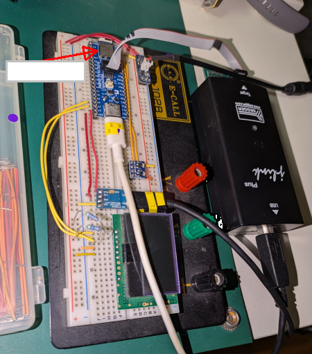

# はじめ方 > 2. 実機とデバッガ

_最終更新日: 2024/11/01_

## サポートするデバイス

### 一覧は Nordic チップが搭載されていないボードもある

nRF Connect SDK がサポートするデバイスはかなり多いように見えるが、注意が必要だ。  
なぜなら Zephyr OS がサポートするボードの一覧がそのまま載っているだけなので、
Nordic のチップが搭載されているとは限らないからだ。

例えばこれは ncs v2.6.1 での一覧である。

* [Supported Boards - v2.6.1](https://docs.nordicsemi.com/bundle/ncs-2.6.1/page/zephyr/boards/index.html)

ncs のバージョン指定はコンボボックスからできるようになっている。  
通常は latest になっているので Nordic の技術ドキュメントを読む際には常に注意しておこう(URLにも出てくる)。  

**しかし！**  
繰り返すが、これは組み込み OS の Zephyr が対応しているボード一覧だ。  
例えばこれは [ST Nucleo F103RB](https://docs.nordicsemi.com/bundle/ncs-2.6.1/page/zephyr/boards/arm/nucleo_f103rb/doc/index.html) だが、これは STM32 が搭載されているだけで Nordic のチップはない。

### Nordic チップが搭載されたボード

まだ開発ボードを購入しておらずに探すのであれば、Zephyr のページから CPU で選ぶとよい。

[Supported Boards and Shields — Zephyr Project Documentation](https://docs.zephyrproject.org/latest/boards/index.html#soc=nrf5340)

Nordic の DKボードであれば間違いは無いしツールの恩恵を最大限に受けることができるのだが、
いかんせん技適を通したボードがないので私から勧めることはできない。
例えば Raytac さんが出している [nRF5340 MDBT53-1M用評価ボード](https://www.switch-science.com/products/8620?_pos=1&_sid=6944ab6c4&_ss=r)であれば技適が通っていて国内でも買いやすいし [Zephyerでもサポート](https://docs.nordicsemi.com/bundle/ncs-2.6.1/page/zephyr/boards/arm/raytac_mdbt53_db_40_nrf5340/doc/index.html)している(私は持っていないが)。

### サポートしていないボードへの対応

もし Nordic のチップが載っていて Zephyr がサポートしていない場合でも、自分でカスタマイズすれば使うことは可能である(製品開発ではそうなるだろう)。  
ただ、そのためにはカスタマイズする知識が先にないと動作確認もできないため、苦労するかもしれない。  
私はこちらの [nRF5340 MDBT53-1Mモジュールピッチ変換基板](https://www.switch-science.com/products/8658) を購入し、カスタマイズするためのファイルも付属していたのだが ncs のバージョンが違うと動作しなかったため苦労することになった。

そういうのも含めて開発の楽しいところではあるのだが、仕事でやるとそうもいっていられないのでボードの選択は慎重に行った方がよいだろう。

## J-Link

これは必須とまではいえないのだが、開発ボードにプログラムを転送するのに JTAG デバッガが必要になることがある。  
開発ボードによっては mbed のように PC と USB 接続してストレージにアクセスするかのようにイメージを転送するタイプもあるのだが、そうでないことも多い。  
私が知っている範囲では J-Link が使われることが多い(それしか見たことがない)。
先ほどの Raytac さんのボードも [Flasing](https://docs.nordicsemi.com/bundle/ncs-2.6.1/page/zephyr/boards/arm/raytac_mdbt53_db_40_nrf5340/doc/index.html#flashing) は J-Link を使っている。

J-Link のデバッガもいろいろあるのだが、どれでもよいわけではない。  
ピンの形状は後付けでなんとかなるのだが、だいたい 1.27mm の 10ピンだと思う(これも確認しよう)。  
一番の問題は J-Link 本体が使おうとしている Nordic のチップに対応しているかどうかである。

私は以前 nRF51822ボードを購入したときに付属していた J-Link LITE Cortex-M というデバッガを使っていた。  
Cortex-M 専用だが nRF51822 には問題なく使えていた。  
そして nRF52830 の開発ボードを購入したので使おうとしたが認識してくれなかった。  
それは手持ちの [J-Link LITE Cortex-M V8](https://wiki.segger.com/J-Link_LITE_Cortex-M_V8) が Cortex-M33 に未対応だったからだ。  
その次のバージョンである V9 はサポートしているようだが、J-Link のメジャーバージョンを上げることはできない。  
[下取り](https://www.segger.com/purchase/trade-in-program/)で安めにできるのかもしれないが、個人でやるような感じがしない。  
幸いなことに私は [J-Link PLUS V10](https://wiki.segger.com/J-Link_PLUS_V10) の中古品を安価で購入できたのでなんとかなった。

そういう場合、[J-Link OB](https://www.segger.com/products/debug-probes/j-link/models/j-link-ob/)というオンボードタイプを選択肢に入れるとよいかもしれない。  
具体的には、[nRF5340DK](https://www.nordicsemi.com/Products/Development-hardware/nRF5340-DK) のような Nordicが出している開発ボードの最新版を購入するのである。  
たとえば nRF5340DK の場合、[nRF51, nRF52, nRF53, nRF91など](https://docs.nordicsemi.com/bundle/ug_nrf5340_dk/page/UG/dk/hw_debug_out_segger53.html)の外部ボードをデバッグするのに使用できるのである。

ただ、私はやったことが無いので J-Link OB の使い方などは他で情報を探してください。

J-Link のバージョンは本体裏のシールかツールを使って確認できる。  
J-Link LITE Cortex-M は基板にプリントされていた。

* [J-Link本体のシリアル番号及びハードウェアバージョンを確認する方法は？](https://www.embitek.co.jp/support/faq/jlink/Q210210/)

ファームウェアのアップデートはできるのだが、メジャーバージョンが変わるようなアップデートはできないのだ。
