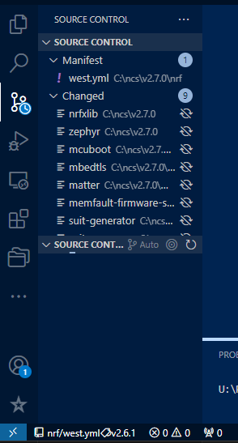
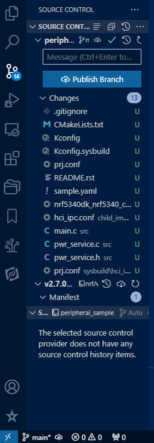
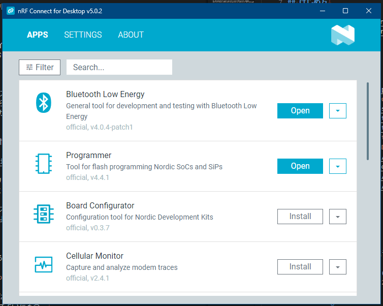

# はじめ方 > 3. プロジェクト

_最終更新日: 2024/11/01_

## vscodeの設定

nRF Connect SDK での開発はほぼ C言語になるだろう。  
そしてクロスコンパイルになるのでネイティブの環境ではない。  
vscode で C/C++ 設定を変更しておくと良いだろう。

```json
"C_Cpp.default.configurationProvider": "nordic-semiconductor.nrf-connect"
```


nRF Connect SDK の開発用に vscode のプロファイルを作っておくとよいかもしれない。

## 新規プロジェクト

nRF Connect SDK for VScode で新規プロジェクトを作る場合、空の`main.c`を持つプロジェクトか、既存のサンプルアプリかを選ぶ。  
どれがよいかは作りたいプロジェクトによるが、BLE peripheral のプロジェクトを空アプリから作るのは大変かもしれない。  
独自の Service / Characteristic を持たせようとするとさらに面倒である。  
サンプルアプリの中で自前の Characterictis 定義を行っているのは "BLE Power Profiling" だけだった。

* [sdk-nrf/samples/bluetooth/peripheral_power_profiling at v2.6.1 · nrfconnect/sdk-nrf](https://github.com/nrfconnect/sdk-nrf/tree/v2.6.1/samples/bluetooth/peripheral_power_profiling)


サンプルコードではないが、DevAcademy BLE Lesson 4 Exercise 2 は LBS(Nordic LED Button Service) を自分で実装してみる練習なのでわかりやすいかもしれない。

* [bt-fund/lesson4/blefund_less4_exer2_solution at main · NordicDeveloperAcademy/bt-fund](https://github.com/NordicDeveloperAcademy/bt-fund/tree/main/lesson4/blefund_less4_exer2_solution)

nRF Connect for VScode としてはディレクトリの中に `prj.conf` というファイルがあるかどうかだけで nRF Connect SDK のプロジェクトかどうかを判定しているようである。

### プロジェクト作成後

プロジェクト作成後は、取りあえず `git init` しておくとよいかもしれない。  
ncs(nRF Connect SDK の略) のディレクトリが表示されて気になるからである。  
Source Control を開かなければ気付かないし、そもそも見た目だけの話なので、そうしなくても問題はない。

これは "BLE Power Profiling" サンプルを使ってプロジェクトを作成した後の Source Control 表示である。  
このように ncs のディレクトリが出てきて、自分のプロジェクトに差分があるのでは、という気持ちになってしまうかもしれない。  
ステータス表示も ncs をインストールした west になっている。



作成したプロジェクトで `git init` すると、Source Control でもプロジェクトの方が優先で表示されるようになる。  
ncs の方も表示されるが、折りたたんでおけば気にならない。



## ビルド

プロジェクトの作成時にはターゲットの指定などはしない。
ビルドするときに初めて設定する。  
ビルドの設定(Build Configuration)は複数持つことができる。

実際の様子は DevAcademy を見ると良い。

* [Exercise 2 - Nordic Developer Academy](https://academy.nordicsemi.com/courses/nrf-connect-sdk-fundamentals/lessons/lesson-1-nrf-connect-sdk-introduction/topic/exercise-2-1/)

だいたいの場合、"Build target" で希望する設定を選択してビルドすれば良い。  
一度ビルドすると、それ以降は Build Configuration を設定してビルドだけすることができる。

nRF5340 は application core と network core を持っていて、さらに application core の方は secure と non-secure があるので複数の設定が出てくる。


概要は DevAcademy を読むのがよいだろう。

* [Board files for multi-core hardware & TF-M - Nordic Developer Academy](https://academy.nordicsemi.com/courses/nrf-connect-sdk-intermediate/lessons/lesson-3-adding-custom-board-support/topic/board-files-for-multi-core-hardware-tf-m/)

Board Configuration の設定は "Build directory name" で指定したディレクトリに保存される。  
このディレクトリの中はビルド時に書き換えられるので、ちょっとだけ変更したいと思ってファイルを編集しても書き換えられることがある。  
`Kconfig`を展開してヘッダファイルに変換されていたりするので、ちょっとした変更であればそのファイルを編集したいところであるがなかなか難しいところである。

### Pristine Build

`Kconfig` を編集したり DTSファイルを編集した場合は Pristine Build をするのがよい。  
Rebuild のようなものだと思っておけば良いだろう。

### カスタマイズしたボード定義

Board target で自分でカスタマイズした設定にすると、まずビルドが通るかどうかの確認をすることになる。  
一から作ることはほぼないだろうから似たような定義ファイルをコピーして作ることになるが、
ビルドエラーになってもエラー内容から設定ミスにたどりつくのが難しい。

特にコツは無い。  
私は Switch Science さんの評価ボードが動くようになるまでひどく悩むことになった。

* [2024年7月～](https://blog.hirokuma.work/2024/2024-2.html)

カスタマイズしたボード定義ファイルを置くためのディレクトリは ncs とは別にできる(`"nrf-connect.boardRoots"`)のだが、
MCUboot のディレクトリに置くことになりそうだった。

プロジェクトに限定したカスタマイズも可能で、その場合はプロジェクトフォルダの中に定義ファイルを置く。  
そうすると自動で読み込んでくれるようだ。

## Flash

これも DevAcademy にあるので見ると良い。

* [Exercise 2 - Nordic Developer Academy](https://academy.nordicsemi.com/courses/nrf-connect-sdk-fundamentals/lessons/lesson-1-nrf-connect-sdk-introduction/topic/exercise-2-1/)

既に書き込まれている内容によっては一度 Erase する必要があるかもしれない。  
書込に失敗したときに Erase すればよいだろう。

### nRF Connect for Desktop

nRF Connect シリーズの中に [for Desktop](https://www.nordicsemi.com/Products/Development-tools/nrf-connect-for-desktop) というアプリがある。



nRF DKボードを持っている場合、スニファのアプリを書き込んで使えるようになったりする。  
DKボードを持っていない場合でも Programmer というアプリは HEXファイルを書き込んだり Erase するのに使うことができる。
